# ABAP RESTful Programming Model Exercise
## Content
- [Creating the database tables](#creating-the-database-tables)
- [Creating the Core Data Services (CDS) Data Model](#creating-the-core-data-services-cds-data-model)
- [Creating CDS Data Model Projection](#creating-cds-data-model-projection)
- [Enriching the Projected Data Model with UI Metadata](#enriching-the-projected-data-model-with-ui-metadata)
- [Developing and Previewing the Business Service](#developing-and-previewing-the-business-service)

# Creating the database tables
> [Exercise](#abap-restful-programming-model-exercise) > [Content](#content) > [This section](#creating-the-database-tables)
## Introduction
You can watch [week 2 unit 2: Creating the Database Tables](https://open.sap.com/courses/cp13/items/2hlNxSdQ9JJZClJcxQOQb6) on the openSAP platform.
     
> **Hints and Tips**    
> Speed up the typing by making use of the Code Completion feature (shortcut *Ctrl+Space*) and the prepared code snippets provided. 
> You can easily open an object with the shortcut *Ctrl+Shift+A*, format your source code using the Pretty Printer feature *Shift+F1* and toggle the fullscreen of the editor using the shortcut *Ctrl+M*.   
>
> A great overview of ADT shortcuts can be found here: [Useful ADT Shortcuts](https://blogs.sap.com/2013/11/21/useful-keyboard-shortcuts-for-abap-in-eclipse/)
>
> Please note that the placeholder **`####`** used in object names in the exercise description must be replaced with the suffix of your choice during the exercises. The suffix can contain a maximum of 4 characters (numbers and letters).
> The screenshots in this document have been taken with the suffix `1234` and system `D20`. Your system id will be `TRL`.

> Please note that the ADT dialogs and views may change in the future due to software updates.

Follow the instructions below.

## Step 1. Create the ABAP Package
First create the new ABAP package **`ZRAP_TRAVEL_####`** (where `####` is your chosen suffix) to group the various development artefacts that you’re going to create during the greenfield implementation of our Travel App. It will be a sub-package of package **`ZRAP_####`** (where `####` is your chosen suffix) created in week 1 unit 6.  
  
1. Go to the Project explorer, right-click on your package **`ZRAP_####`** (where `####` is your chosen suffix) you created in week 1 unit 6 and choose the context menu entry **_New > ABAP Package_**.  
   
    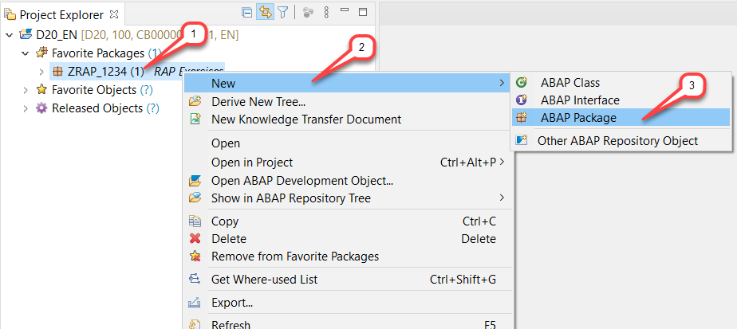
  
2. Maintain **`ZRAP_TRAVEL_####`** as name (where `####` is your chosen suffix) and a meaningful description (e.g. _**Greenfield Implementation - Travel List Report App**_) and choose **Next** to continue.  
The Project and the Superpackage fields are automatically assigned.

> Note: In some instances the Superpackage field is not automatically assigned. You then have to browse and search for the package or enter the name of the superpackage manually. It is the package **`ZRAP_####`** (where `####` is your chosen suffix) created in week 1 unit 6.  
   

   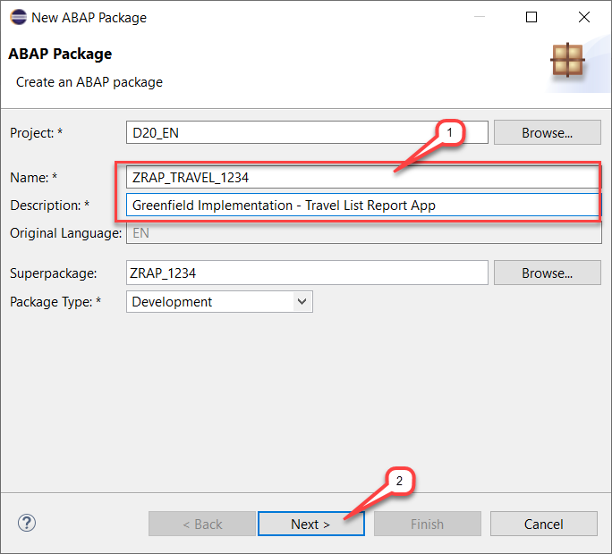
    
  
4. Select an existing transport request or create a new one and then choose **Finish** to create the new package.  
   

    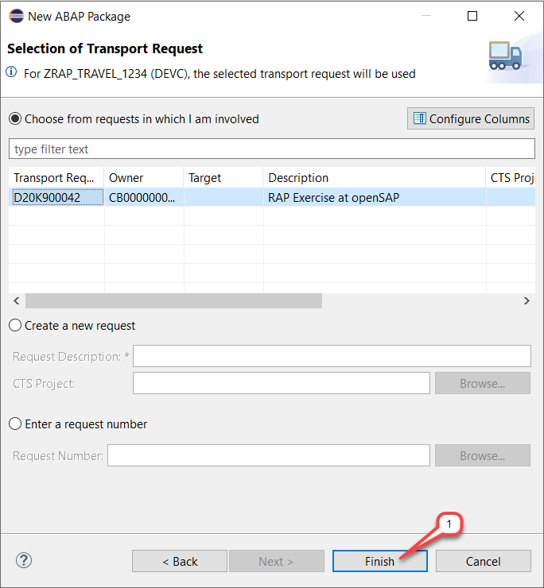
  

    The package is now created.  
   

    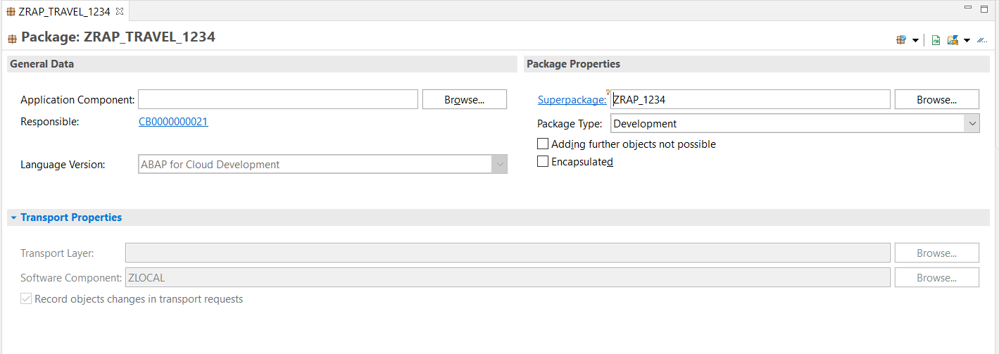
  
5. Right-click on the new created package and choose  **Add to Favorites Packages** to add it to your favorites.  
   

    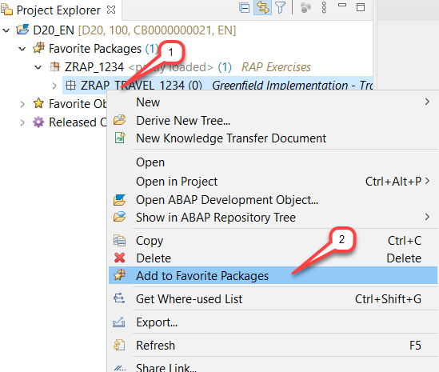
    
  
## Step 2. Create the Travel Database Table  
You will now create the database table **`ZRAP_ATRAV_####`** (where `####` is your chosen suffix),  to store the travel data.  
A Travel entity defines general travel data, such as the agency ID or customer ID, the status of the travel booking, and the price of travel.   
1. Right click on your package **`ZRAP_TRAVEL_####`**, choose **_New > Other ABAP Repository Object_** from the context menu.   
   

    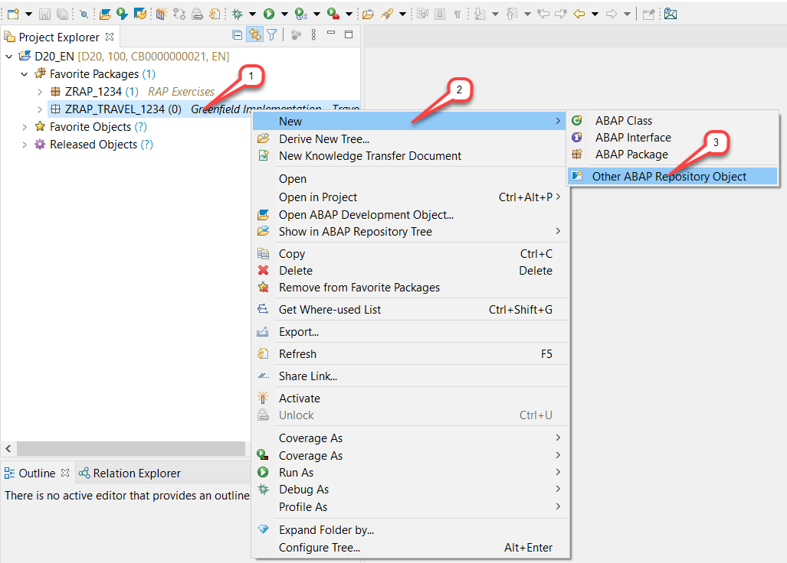

2. Enter `database` in the search field, choose **Database table** in the list and then choose **Next**.  
   

    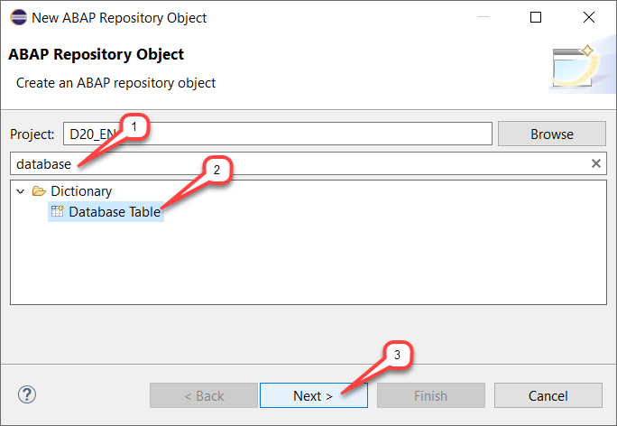

3. Maintain **`ZRAP_ATRAV_####`** as name and a meaningful description (e.g. _**Travel data**_) in the appearing dialog and choose **Next**.  
   

    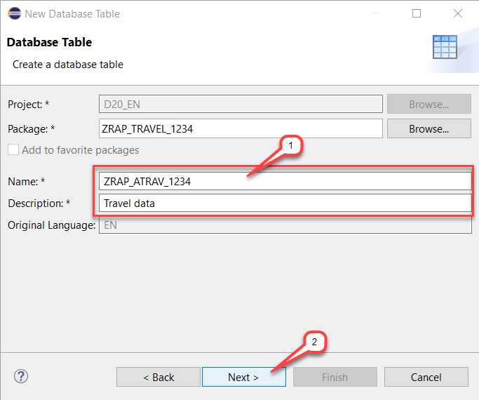

4. Assign a transport request and choose **Finish**.  
   

    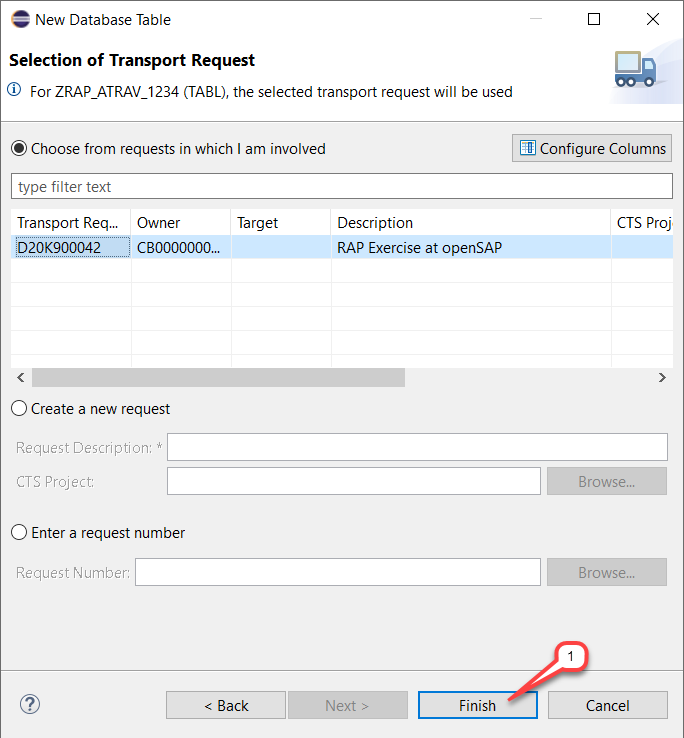

    The table is created, and the default code displayed in the new editor.  
    The default table-specific technical settings are specified using annotations at the top.  
 

    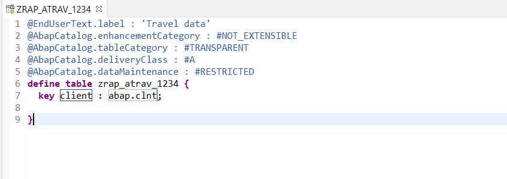  

5. Replace the default source code with the code snippet provided below and replace all occurrences of  `####` with your chosen suffix.  
    You can make use of the Replace All feature (**Ctrl+F**) in ADT for the purpose.   
  
    ```ABAP
    @EndUserText.label : 'Travel data'
    @AbapCatalog.enhancementCategory : #NOT_EXTENSIBLE
    @AbapCatalog.tableCategory : #TRANSPARENT
    @AbapCatalog.deliveryClass : #A
    @AbapCatalog.dataMaintenance : #RESTRICTED
    define table zrap_atrav_#### {
      key client            : mandt not null;
      key travel_uuid       : sysuuid_x16 not null;
      travel_id             : /dmo/travel_id;
      agency_id             : /dmo/agency_id;
      customer_id           : /dmo/customer_id;
      begin_date            : /dmo/begin_date;
      end_date              : /dmo/end_date;
      @Semantics.amount.currencyCode : 'zrap_atrav_####.currency_code'
      booking_fee           : /dmo/booking_fee;
      @Semantics.amount.currencyCode : 'zrap_atrav_####.currency_code'
      total_price           : /dmo/total_price;
      currency_code         : /dmo/currency_code;
      description           : /dmo/description;
      overall_status        : /dmo/overall_status;
      created_by            : syuname;
      created_at            : timestampl;
      last_changed_by       : syuname;
      last_changed_at       : timestampl;
      local_last_changed_at : timestampl;
    }
    ```
   

    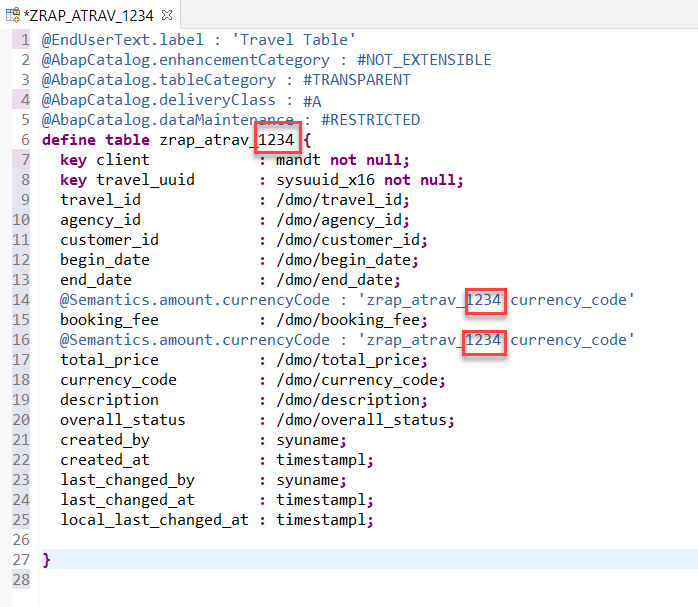
  

    **Short explanations:**  
    - Some data elements from the ABAP Flight Reference Scenario (namespace `/DMO/`) are used.  
    - The table key consists of the `CLIENT` field and the `TRAVEL_UUID` field which is a technical key (16 Byte UUID).   
    - A human-readable travel identifier: `TRAVEL_ID`  
    - The field CURRENCY_CODE is specified as currency key for the amount fields `BOOKING_FEE` and `TOTAL_PRICE` using the semantic annotation `@Semantics.amount.currencyCode`   
    - Some standard administrative fields are defined: `CREATED_BY`, `CREATED_AT`, `LAST_CHANGED_BY`, `LAST_CHANGED_AT` and `LOCAL_LAST_CHANGED_AT`.  
  
6. Save  and activate  the changes.  
  
7. Press **F8** to start the data preview.  
    Well, the database table is empty for now, so no data is displayed.  
   

    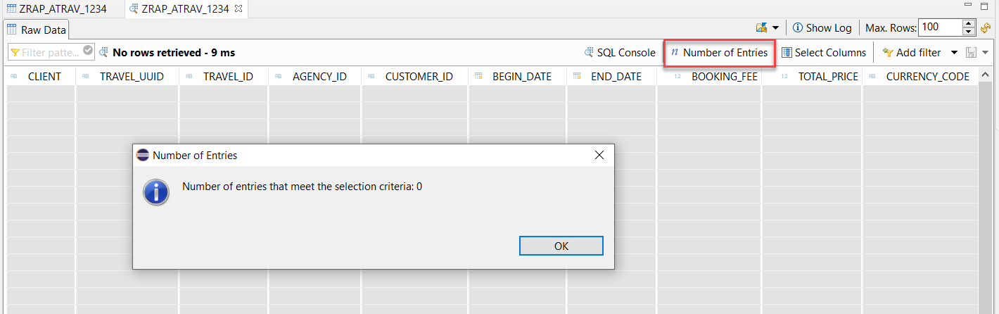

## Step 3. Create the Booking Database Table
You will now create the database table **`ZRAP_ABOOK_####`** (where `####` is your chosen suffix),  to store the booking data.   
A Booking entity comprises general flight and booking data, the customer ID for whom the flight is booked as well as the travel ID to which the booking belongs – and some admin fields.  
  
1. Right click on the **Database Tables** folder, choose **New Database Table** from the context menu.  

    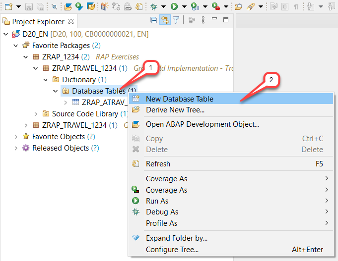
  
3. Maintain **`ZRAP_ABOOK_####`** as name and a meaningful description (e.g. _**Booking data**_) in the appearing dialog and choose **Next**. 

    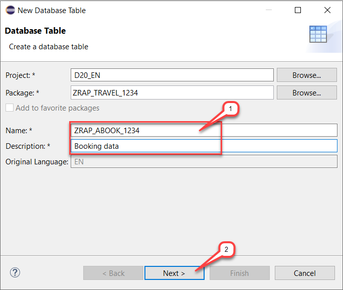
  
4.  Assign a transport request and choose **Finish**.  

    

    The table is created, and the default code displayed in the new editor.  
    The default table-specific technical settings are specified using annotations at the top – before the **`DEFINE TABLE`** statement.     

    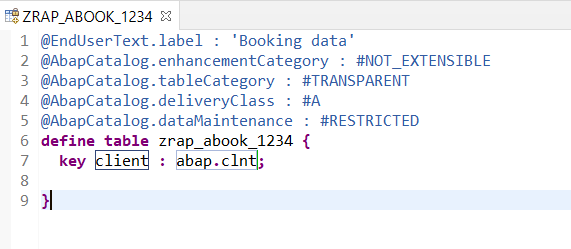
  
5. Replace the default source code with the code snippet provided below and replace all occurrences of  `####` with your chosen suffix.   
    You can make use of the Replace All feature (shortcut **Ctrl+F**) in ADT for the purpose.  
  
    ```ABAP 
    @EndUserText.label : 'Booking data'
    @AbapCatalog.enhancementCategory : #NOT_EXTENSIBLE
    @AbapCatalog.tableCategory : #TRANSPARENT
    @AbapCatalog.deliveryClass : #A
    @AbapCatalog.dataMaintenance : #RESTRICTED
    define table zrap_abook_#### {
      key client            : mandt not null;
      key booking_uuid      : sysuuid_x16 not null;
      travel_uuid           : sysuuid_x16 not null;
      booking_id            : /dmo/booking_id;
      booking_date          : /dmo/booking_date;
      customer_id           : /dmo/customer_id;
      carrier_id            : /dmo/carrier_id;
      connection_id         : /dmo/connection_id;
      flight_date           : /dmo/flight_date;
      @Semantics.amount.currencyCode : 'zrap_abook_####.currency_code'
      flight_price          : /dmo/flight_price;
      currency_code         : /dmo/currency_code;
      created_by            : syuname;
      last_changed_by       : syuname;
      local_last_changed_at : timestampl;
    }
    ```   

    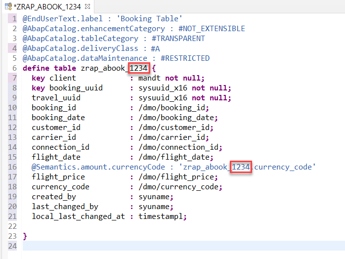
  
    **Short explanations:**
    - Some data elements from the ABAP Flight Reference Scenario (namespace /DMO/) are used.  
    - The table key consists of the `CLIENT` field and the `BOOKING_UUID` field which is a technical key (16 Byte UUID).   
    - A human-readable travel identifier: `BOOKING_ID`  
    - The field CURRENCY_CODE is specified as currency key for the amount field FLIGHT_PRICE using the semantic annotation `@Semantics.amount.currencyCode`.  
    - Some standard administrative fields are defined: `CREATED_BY`, `LAST_CHANGED_BY`, and `LOCAL_LAST_CHANGED_AT`.  
  
  6. Save  and activate  the changes.  
  
7. Press **F8** to start the data preview.   
    Well, the database table is empty for now, so no data is displayed.  
 

    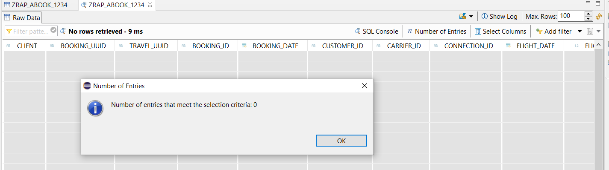
  
## Step 4. Fill in the Database Tables with Demo Data
You will now fill in the created travel and booking database tables with some demo data to ease the test. Demo data provided by the ABAP Flight Reference Scenario (main package: `/DMO/FLIGHT`) will be used for the purpose.   
  
1. Right click on your package **_ZRAP_TRAVEL_####** and choose **_New > ABAP Class_** from the context menu.      

    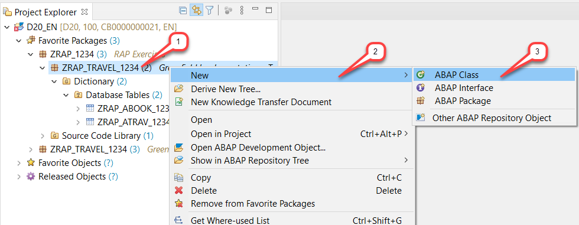

2. Maintain **`ZCL_GENERATE_DEMO_DATA_####`** as name and a meaningful description (e.g. _**Generate Travel and Booking demo data**_) in the creation wizard for the new ABAP class.  
    Add the ABAP interface **`IF_OO_ADT_CLASSRUN`** which needs to be implemented to write outputs to the ABAP Console and continue with **Next**.  

    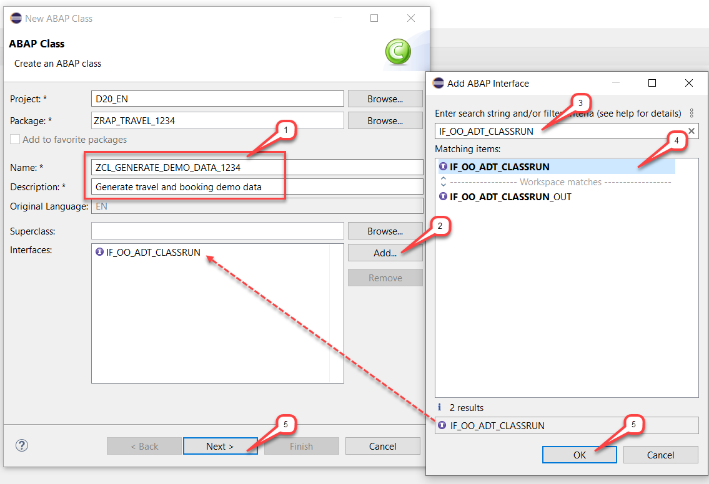

3. Assign a transport request and choose **Finish**.  
   
    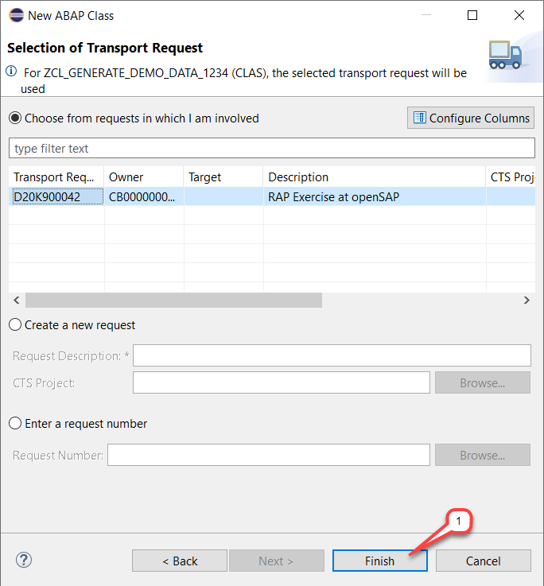

    The ABAP class is created and opened in the source-based class editor area, ready for you to implement.  
  
4. Insert the implementation of method **`if_oo_adt_classrun~main`**  with the code snippet provided below (after **CLASS zcl_generate_demo_data_#### IMPLEMENTATION.** and before **ENDCLASS.**) as shown on the screenshot below, and replace all occurrences of  `####` with your chosen suffix.   
You can make use of the Replace All feature (**Ctrl+F**) in ADT for the purpose.  
  
    ```ABAP 
    METHOD if_oo_adt_classrun~main.

    " delete existing entries in the database table
    DELETE FROM zrap_atrav_####.
    DELETE FROM zrap_abook_####.

    " insert travel demo data
    INSERT zrap_atrav_#### FROM (
        SELECT
          FROM /dmo/travel
          FIELDS
            uuid(  )      AS travel_uuid           ,
            travel_id     AS travel_id             ,
            agency_id     AS agency_id             ,
            customer_id   AS customer_id           ,
            begin_date    AS begin_date            ,
            end_date      AS end_date              ,
            booking_fee   AS booking_fee           ,
            total_price   AS total_price           ,
            currency_code AS currency_code         ,
            description   AS description           ,
            CASE status
              WHEN 'B' THEN 'A' " accepted
              WHEN 'X' THEN 'X' " cancelled
              ELSE 'O'          " open
            END           AS overall_status        ,
            createdby     AS created_by            ,
            createdat     AS created_at            ,
            lastchangedby AS last_changed_by       ,
            lastchangedat AS last_changed_at       ,
            lastchangedat AS local_last_changed_at
            ORDER BY travel_id UP TO 200 ROWS
      ).
    COMMIT WORK.

    " insert booking demo data
    INSERT zrap_abook_#### FROM (
        SELECT
          FROM   /dmo/booking    AS booking
            JOIN zrap_atrav_#### AS z
            ON   booking~travel_id = z~travel_id
          FIELDS
            uuid( )                 AS booking_uuid          ,
            z~travel_uuid           AS travel_uuid           ,
            booking~booking_id      AS booking_id            ,
            booking~booking_date    AS booking_date          ,
            booking~customer_id     AS customer_id           ,
            booking~carrier_id      AS carrier_id            ,
            booking~connection_id   AS connection_id         ,
            booking~flight_date     AS flight_date           ,
            booking~flight_price    AS flight_price          ,
            booking~currency_code   AS currency_code         ,
            z~created_by            AS created_by            ,
            z~last_changed_by       AS last_changed_by       ,
            z~last_changed_at       AS local_last_changed_by
      ).
    COMMIT WORK.

    out->write( 'Travel and booking demo data inserted.').
    ENDMETHOD.
    ```
   
    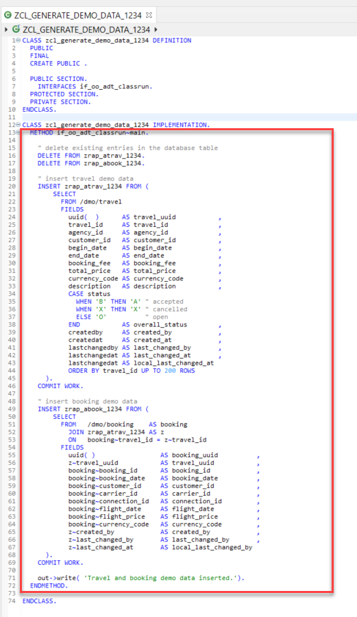

    **Short explanations:**  
    - First, any existing entries in both database tables are deleted.  
    - Then the data is selected from the tables `/DMO/TRAVEL` and `/DMO/BOOKING` and inserted into your tables `ZRAP_ATRAV_####` and `ZRAP_ABOOK_####` respectively.  
    - The SQL function `UUID( )` is used to set the value of the key fields `TRAVEL_UUID` and `BOOKING_UUID`.   
    - The `COMMIT WORK` statement is then executed to persist the data. The data selection has been limited to up to 200 travel records, but you can change this if desired.  
    - A success message is written to the Console at the end.  
  
5. Save  and activate  the changes.  
  
6. Press **F9** to run the ABAP class as a console application to generate the demo data and and fill your tables.
   
    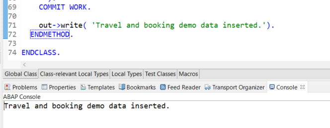
  
7. Now you can preview the data from the Travel and Booking database tables.  
    Choose the relevant database table (`ZRAP_ATRAV_####` or `ZRAP_ABOOK_####` where #### is your chosen suffix) in the Project Explorer and press **F8**.  
        
    The Data Preview will open in the editor area.  
    You can play around with the data preview - e.g. choose the **Number of Entries** or **SQL Console**, or filter the entries with **Add filter**.
   
    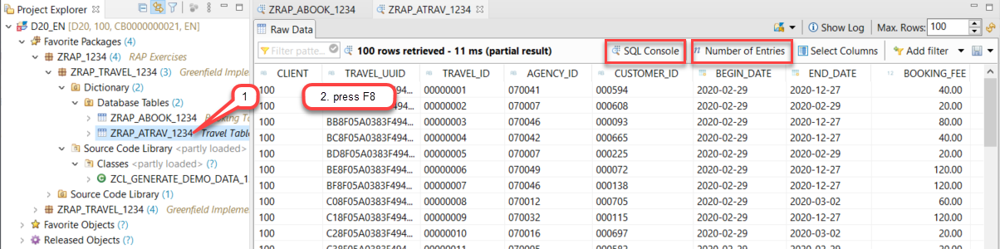

# Creating the Core Data Services (CDS) Data Model
> [Exercise](#abap-restful-programming-model-exercise) > [Content](#content) > [This section](#creating-the-core-data-services-cds-data-model)
## Introduction  
You will define the travel and the booking interface views (aka BO views) of the CDS data model for your travel app. We will directly define the business object structure - i.e. the composition tree – in this exercise.    
    
You can watch [week 2 unit 3: Creating the Core Data Services (CDS) Data Model](https://open.sap.com/courses/cp13/items/2ZlW59g1Q7MQ21KXTYUPUn) on the openSAP platform.
    
## Step 1.	Create the Interface CDS View for the Travel Entity
First, create the Interface CDS view **`ZI_RAP_Travel_####`** (where `####` is your chosen suffix)  for the Travel entity. 
1. Right-click on your travel table **`ZRAP_ATRAV_####`** and choose **New Data Definition** from the context menu.

 
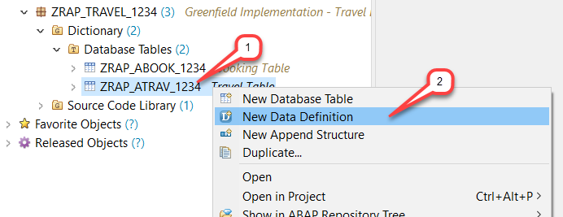

2.  Maintain **` ZI_RAP_Travel_####`** as name and a meaningful description (e.g. _**Travel BO view**_) in the creation wizard and choose **Next** to continue.  
The project, the package and the referenced object have been automatically assigned.
    >**Please note**    
    >In this course, we will follow the naming convention of the Virtual Data Model (VDM) of the SAP S/4HANA where the name of interface or BO views begins with _`<namespace>I`_ (e.g _`ZI_`_) and the name of consumption or projection views begins with the namespace followed by _`<namespace>C`_ (e.g. _`ZC_`_).
     
    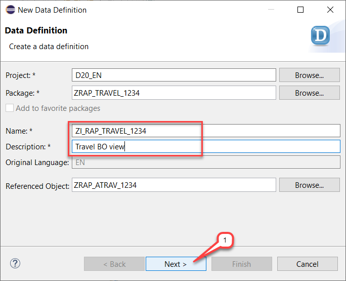

3. Assign a transport request and choose **Next**. 

    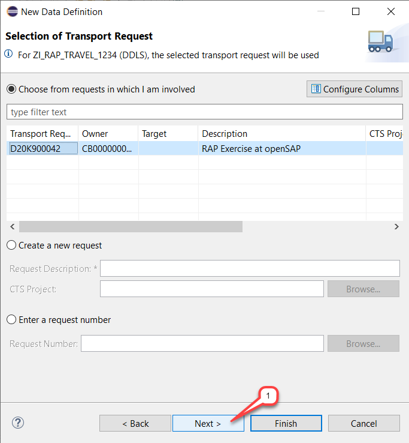
  
4. Choose the **Define View entity** template from the list of Data Definition templates provided for your convenience and then choose **Finish**.
    
    > **Excursus:**    
    > One of the main differences between CDS DDIC-based view and CDS view entity, is that the latter does not have an associated SQL view, and the name of the Data Definition object in the Project Explorer and the name of the CDS entity specified after the keyword `DEFINE VIEW ENTITY` are identical. This makes the lifecycle of CDS View entities way easier.
    
    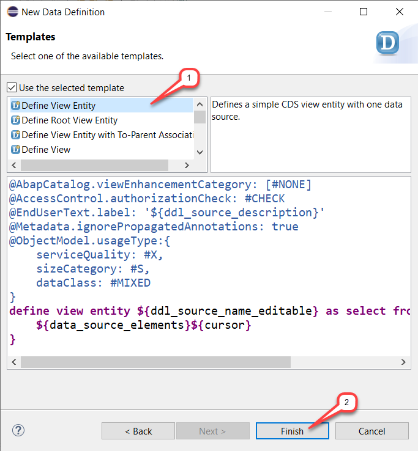

    The new data definition appears in the appropriate editor.

    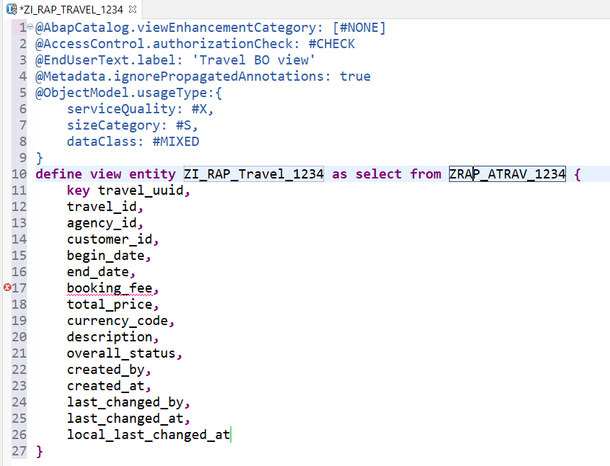

    **Short Explanation:**    
    The travel table `ZRAP_ATRAV_1234` is used as data source and the table fields have been automatically inserted in the projection list between the curly brackets `{}` – except the client field which is handled implicitly by the platform because the view is client specific. The view key element is specified with the keyword **`key`**.

5. Replace the code of the travel data definition in the editor with the code snippet provided below and replace all occurrences of  `####` with your chosen suffix. 
   You can make use of the _Replace All_ feature (**Ctrl+F**) in ADT for the purpose.  

   Save  the changes, but **DO NOT** activate the travel interface view yet.

    ```ABAP
    @AccessControl.authorizationCheck: #CHECK
    @EndUserText.label: 'Travel BO view'
    define view entity ZI_RAP_Travel_####
      as select from zrap_atrav_#### as Travel

      association [0..*] to ZI_RAP_Booking_#### as _Booking on $projection.TravelUUID = _Booking.TravelUUID
      
      association [0..1] to /DMO/I_Agency       as _Agency   on $projection.AgencyID = _Agency.AgencyID
      association [0..1] to /DMO/I_Customer     as _Customer on $projection.CustomerID = _Customer.CustomerID
      association [0..1] to I_Currency          as _Currency on $projection.CurrencyCode = _Currency.Currency  
    {
      key travel_uuid           as TravelUUID,
          travel_id             as TravelID,
          agency_id             as AgencyID,
          customer_id           as CustomerID,
          begin_date            as BeginDate,
          end_date              as EndDate,
          @Semantics.amount.currencyCode: 'CurrencyCode'
          booking_fee           as BookingFee,
          @Semantics.amount.currencyCode: 'CurrencyCode'
          total_price           as TotalPrice,
          currency_code         as CurrencyCode,
          description           as Description,
          overall_status        as TravelStatus,
          @Semantics.user.createdBy: true
          created_by            as CreatedBy,
          @Semantics.systemDateTime.createdAt: true
          created_at            as CreatedAt,
          @Semantics.user.lastChangedBy: true
          last_changed_by       as LastChangedBy,
          @Semantics.systemDateTime.lastChangedAt: true
          last_changed_at       as LastChangedAt,
          @Semantics.systemDateTime.localInstanceLastChangedAt: true
          local_last_changed_at as LocalLastChangedAt,

          /* associations */
          _Booking,
          _Agency,
          _Customer,
          _Currency      
    }
    ```

    The travel data definition should look as follows.

    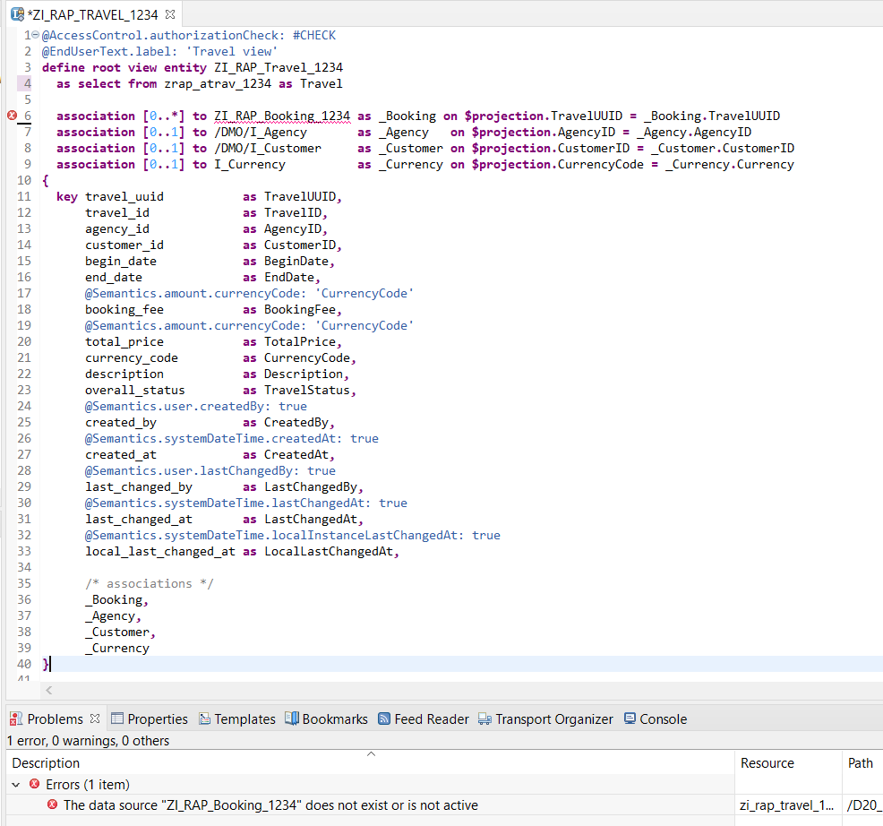

    **Short explanation: What has changed?**      
    - Following view annotations, specified at the top of the data definition template, have been removed, because they are not relevant for our scenario:
        ```ABAP 
        @AbapCatalog.viewEnhancementCategory: [#NONE]  
        @Metadata.ignorePropagatedAnnotations: true  
        @ObjectModel.usageType:{
            serviceQuality: #X,
            sizeCategory: #S,
            dataClass: #MIXED
        }
        ```             
    - The alias **`Travel`**  is now specified for the data source using the keyword **`as`**.
    - Associations are defined for the entities Booking (**`_Booking`**), Agency (**`_Agency`**), Customer (**`_Customer`**) and Currency (**`_Currency`**) – and exposed in the projection list.
    An error is currently displayed by the association **`_Booking`**, because the specified Booking BO view **`ZI_RAP_Booking_####`** does not yet exist. You will create it in the next step.
    - A CamelCase alias has been specified for each view elements using the keyword **`as`**.    
      PS: The alias **`TravelStatus`**  is used for the view element **`Overall_Status`**.
    - To ensure uniform data processing on the consumer side, **`@Semantics`** annotations are used to enrich some of the fields – i.e. the currency fields and the administrative fields in the present scenario.   
    The currency key field **`CurrencyCode`** is specified as the reference field of the currency fields **`BookingFee`** and **`TotalPrice`** using the annotation **`@Semantics.amount.currencyCode`**.     
    The annotation of the administrative data is a preparation step for week 3, where the transactional behavior of the Travel List Report app will be enabled. These annotations are required to allow the automatic update of the fields on every operation.
                
>**Note:** DO NOT yet activate the CDS data definition as you are not yet done with the definition of the Travel interface view. The BO structure is not yet defined. **This will be done in step 4**.

## Step 2.	Create the Interface CDS View for the Booking entity
Now, you will create the Interface CDS view **`ZI_RAP_Booking_####`** (where #### is your chosen suffix) for the Booking entity.
1. Right-click on your booking table **`ZRAP_ABOOK_####`** and choose **New Data Definition** from the context menu.

    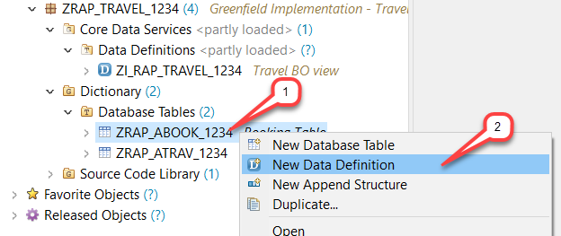

2.  Maintain **`ZI_RAP_Booking_####`** as name and a meaningful description (e.g. _**Booking BO view**_) in the creation wizard and choose **Next** to continue.  
   The project, the package and the referenced object have been automatically assigned.  
 
    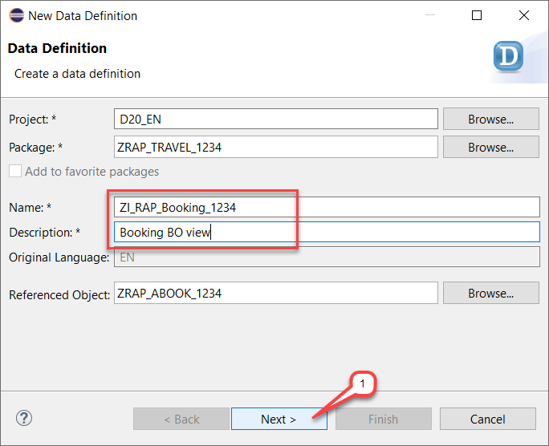

3. Assign a transport request and choose **Next**. 
 
    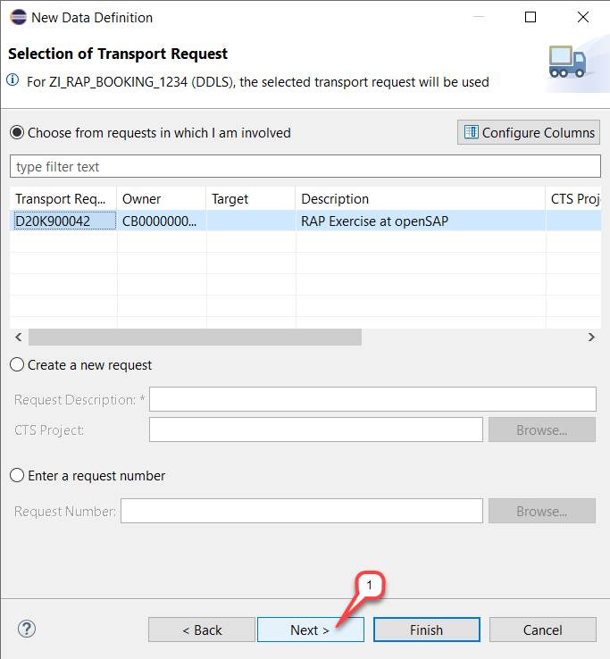

4. Choose the Define View entity template from the list and then choose **Finish**.
The new data definition appears in the editor. You can make use of the Source Code Formatter (**SHIFT+1**) to format the source code.
 
    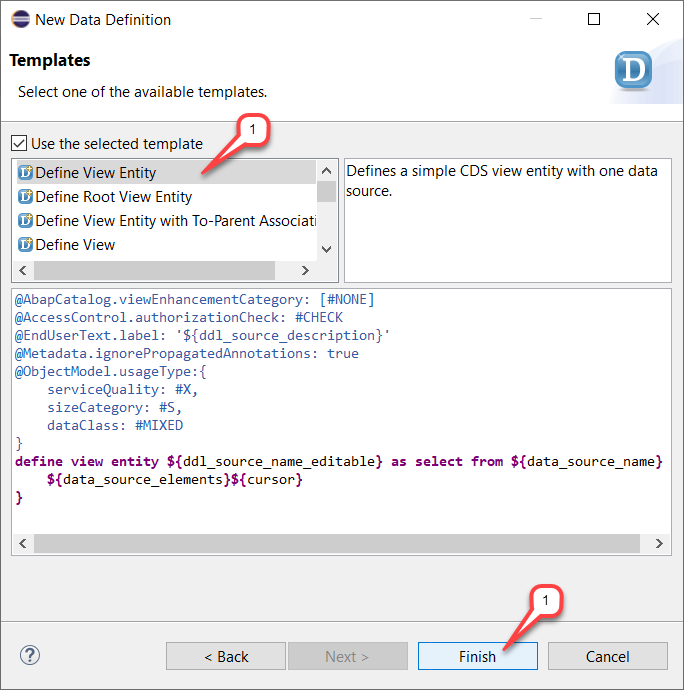

    The booking data definition should look as follows.
 
    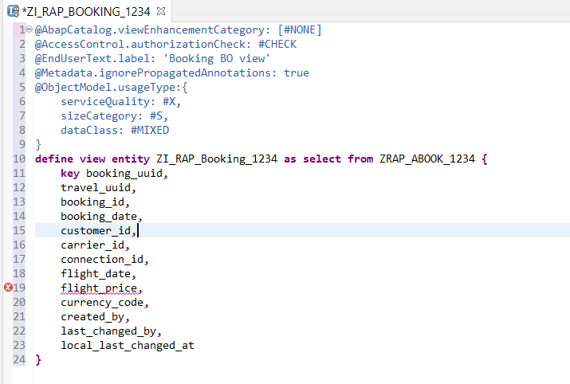

5. Replace the booking data definition in the editor with the code snippet provided below and replace all occurrences of  `####` with your chosen suffix. You can make use of the _Replace All_ feature (**Ctrl+F**) in ADT for the purpose.  
    
    Save the changes, but **DO NOT** activate the booking interface view yet. 

    ```ABAP
    @AccessControl.authorizationCheck: #CHECK
    @EndUserText.label: 'Booking BO view'
    define view entity ZI_RAP_Booking_####
      as select from zrap_abook_#### as Booking

      association [1..1] to ZI_RAP_Travel_####        as _Travel     on  $projection.TravelUUID = _Travel.TravelUUID
      
      association [1..1] to /DMO/I_Customer           as _Customer   on  $projection.CustomerID   = _Customer.CustomerID
      association [1..1] to /DMO/I_Carrier            as _Carrier    on  $projection.CarrierID    = _Carrier.AirlineID
      association [1..1] to /DMO/I_Connection         as _Connection on  $projection.CarrierID    = _Connection.AirlineID
                                                                     and $projection.ConnectionID = _Connection.ConnectionID
      association [1..1] to /DMO/I_Flight             as _Flight     on  $projection.CarrierID    = _Flight.AirlineID
                                                                     and $projection.ConnectionID = _Flight.ConnectionID
                                                                     and $projection.FlightDate   = _Flight.FlightDate
      association [0..1] to I_Currency                as _Currency   on $projection.CurrencyCode    = _Currency.Currency    
    {
      key booking_uuid          as BookingUUID,
          travel_uuid           as TravelUUID,
          booking_id            as BookingID,
          booking_date          as BookingDate,
          customer_id           as CustomerID,
          carrier_id            as CarrierID,
          connection_id         as ConnectionID,
          flight_date           as FlightDate,
          @Semantics.amount.currencyCode: 'CurrencyCode'
          flight_price          as FlightPrice,
          currency_code         as CurrencyCode,
          @Semantics.user.createdBy: true
          created_by            as CreatedBy,
          @Semantics.user.lastChangedBy: true
          last_changed_by       as LastChangedBy,
          @Semantics.systemDateTime.localInstanceLastChangedAt: true
          local_last_changed_at as LocalLastChangedAt,

          /* associations */
          _Travel,
          _Customer,
          _Carrier,
          _Connection,
          _Flight,
          _Currency
    }
    ```

    The booking data definition should look as follows.

    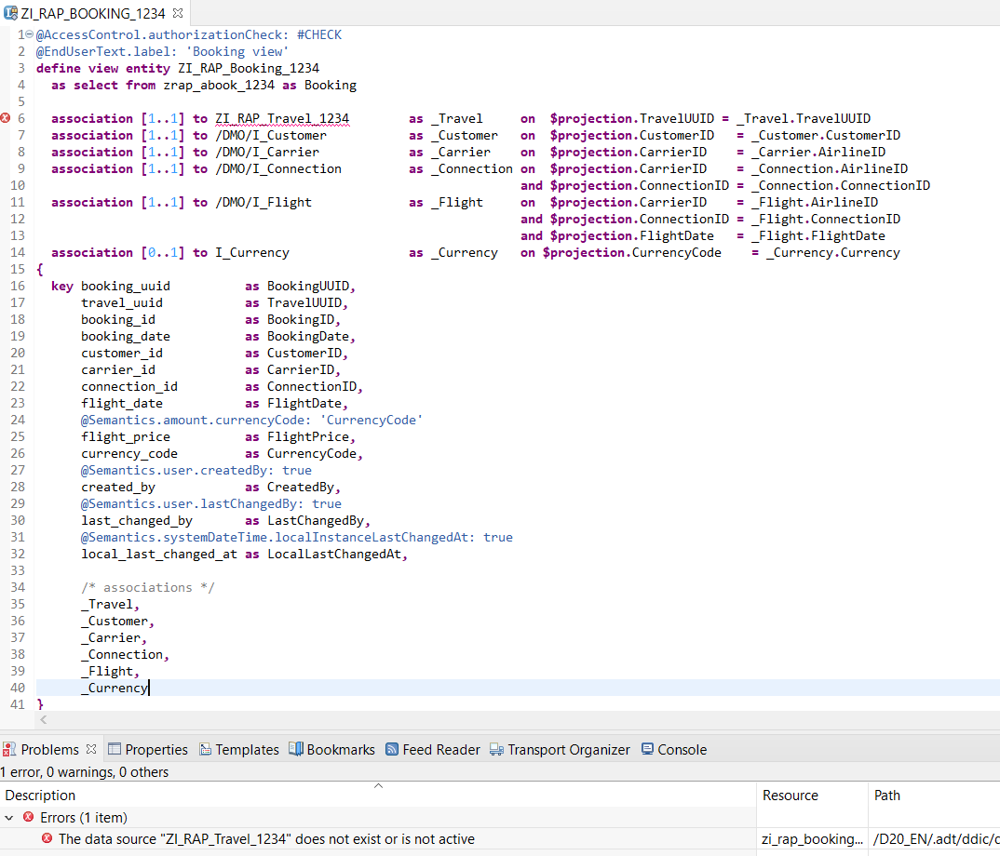

    The view columns have now aliases, the associations to the entities Travel, Customer, Carrier, Flight and Currency are specified – and added to the projection list.
    @Semantics annotations are also specified for the currency field XXXX and the administrative fields.


    >**Note:** You are not yet through with the definition of the Booking interface view, because the BO structure is not yet defined. You will do it in step 4 of this exercise.

## Step 3.	Activate the CDS Data Model & Preview the Data 
To avoid an error during the activation, both new CDS views – i.e. the Travel interface view and the Booking interface view – must be activated together for the first time.  

1.	Choose **Activate All**  or use the shortcut **Ctrl+Shift+F3**.    
    Select both CDS views **`ZI_RAP_TRAVEL_####`** and **`ZI_RAP_BOOKING_####`** on the appearing dialog, and choose **Activate**.
 
    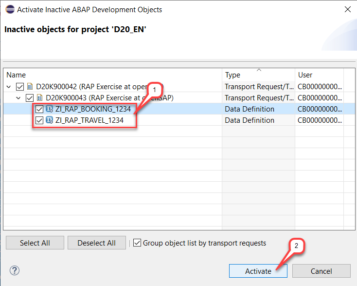

    Both CDS views are now activated, but warnings are displayed in the _Problems_ view and in the editor. The reason behind this is that the authority check is allowed for these CDS views (`@AccessControl.authorizationCheck: #CHECK`), but no CDS access control is currently defined for them. You will work on this in unit 7 of week 2 where you will define a basic CDS access control.
 
     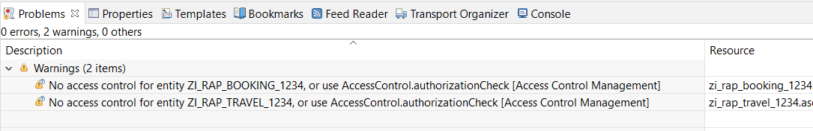

2.	To run the Data Preview, choose the relevant CDS data definition – i.e. **`ZI_RAP_TRAVEL_####`** or **`ZI_RAP_BOOKING_####`** where `####`is your chosen suffix – in the Project Explorer (or open it in the editor) and press **F8**.  
  
     The Data Preview will open in the editor area.  
 
    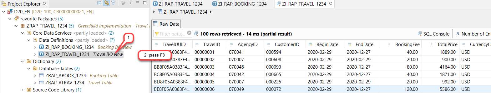


## Step 4.	Define the Composition Model
Finally, you will now enhance the CDS data model to specify the business object structure: The composition model (or composition tree). 
As already mentioned in the introduction of this unit, this step is not mandatory when building read-only application. It is only a preparation for the hands-on exercises of week 3 where you’re are going to enable the transactional behavior of your Travel App. Nevertheless, this is a typical step when defining your CDS data model since read-only and transactional apps can be built on top of the same data model.  
Our composition model consists of two nodes: The root node travel and its child node booking.

1.	Open the CDS data definition **`ZI_RAP_TRAVEL_####`** (where `####` is your chosen suffix) and add the keyword **`root`**  in the **`define view entity`** statement to change it as follows:
    ```ABAP
      define root view entity ZI_RAP_Travel_####
    ```

2.	Adjust the definition of the **`_Booking`** association to a composition which is needed to define the relationship from a parent node (travel) to a child node (booking). 
For that, replace the definition of the association **`_Booking`** with the following composition definition:  
    ```ABAP
       composition [0..*] of ZI_RAP_Booking_#### as _Booking 
    ```

3.	Save  the changes, but **DO NOT** yet activate the changes. 
    The travel data definition as shown on the screenshot below
 
    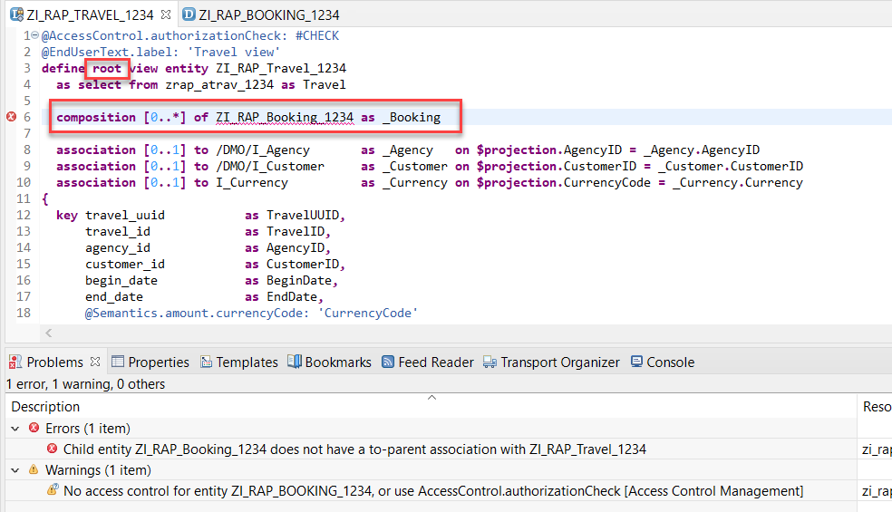

4.	Now open the CDS data definition **`ZI_RAP_BOOKING_####`** and replace the definition of the association **`_Travel`** with the definition provided below to specify the relationship from the child node (_booking_) to its parent node (_travel_). 

    ```ABAP
      association to parent ZI_RAP_Travel_####        as _Travel     on  $projection.TravelUUID = _Travel.TravelUUID
    ```

    

5.	Save  the changes and activate **BOTH** CDS views together by choosing **Activate All**  or using the shortcut **Ctrl+Shift+F3**, selecting both CDS views in the appearing dialog and choosing **Activate**.
 
    

    These changes have no impact on the data. You can again run (**F8**) the Data Preview.

# Creating CDS Data Model Projection
> [Exercise](#abap-restful-programming-model-exercise) > [Content](#content) > [This section](#creating-cds-data-model-projection)
## Introduction
You will define the CDS data model projection for your travel app on top of the CDS data model defined in the previous exercise. 
With projection views, you can expose only those elements that are relevant for the specific service. You can de-normalize the underlying data model and also define fine-tuning such as virtual elements, value helps, search and UI semantics.
    
You can watch [week 2 unit 4: Creating the CDS Data Model Projection](https://open.sap.com/courses/cp13/items/49GF6acceUwItzEuJoffCP) on the openSAP platform.

## Step 1. Create the Travel Projection View

First, create the Travel BO projection view (aka consumption view) **`ZC_RAP_Travel_####`** (where `####` is your chosen suffix)  for the Travel entity.

1. Right-click on your travel BO view (aka interface view) **`ZI_RAP_Travel_####`** and choose **New Data Definition** from the context menu.
 
    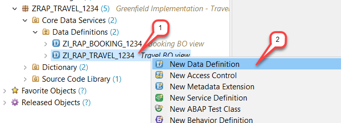

2.  Maintain **`ZC_RAP_Travel_####`** as name and a meaningful description (e.g. _**Travel BO projection view**_) in the creation wizard and choose **Next >** to continue.   
The project, the package and the referenced object have been automatically assigned in the creation wizard. 


    >**Please note**    
    >In this course, we will follow the naming convention of the Virtual Data Model (VDM) of the SAP S/4HANA where the name of interface or BO views begins with _`<namespace>I`_ (e.g _`ZI_`_) and the name of consumption or projection views begins with the namespace followed by _`<namespace>C`_ (e.g. _`ZC_`_).    
    

    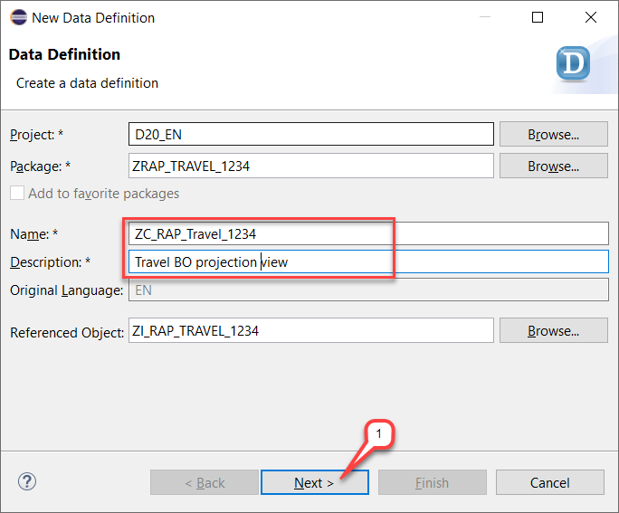

3. Assign a transport request and choose **Next >**.  

    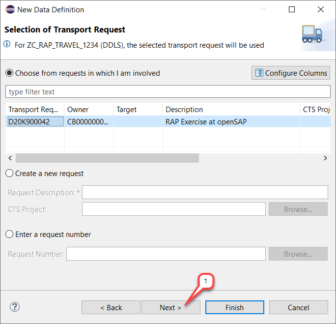

4. Choose the **`Define Projection View`** template from the list and then choose **Finish**.

    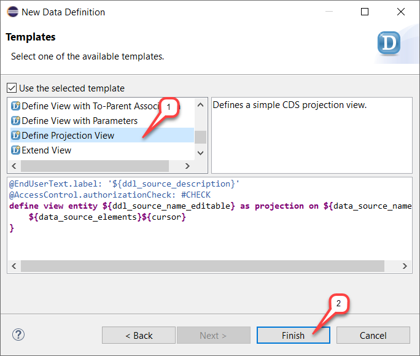


    The new data definition appears in the editor. 


    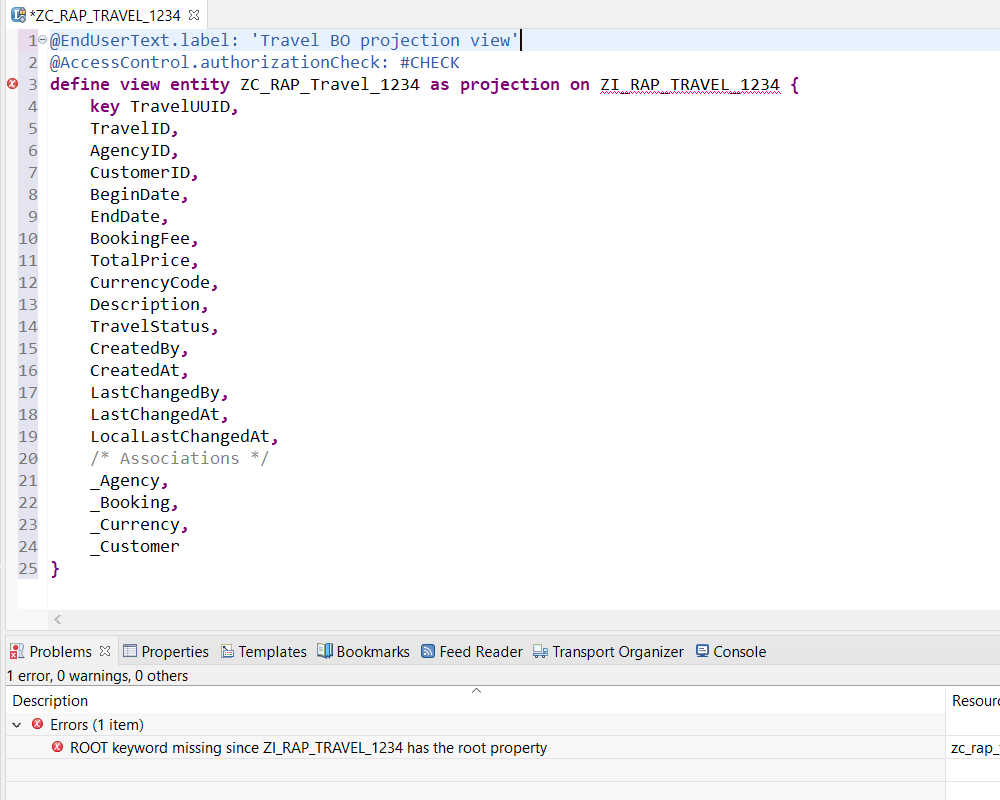
    
    
    **Short Explanation:**    
    The travel BO view is specified as projection view and all view elements have been automatically inserted in the projection list between the curly brackets.

5. Replace the travel data definition in the editor with the code snippet provided below and replace all occurrences of **`####`** with your chosen suffix. You can make use of the _Replace All_ feature (**Ctrl+F**) in ADT for the purpose.

    Save  the changes, but **DO NOT** yet activate the travel BO projection view.

    You can make use of the Source Code Formatter (**Shift+1**) to format the source code.
    ```ABAP
    @EndUserText.label: 'Travel BO projection view'
    @AccessControl.authorizationCheck: #CHECK
    @Search.searchable: true
    @Metadata.allowExtensions: true

    define root view entity ZC_RAP_Travel_####
      as projection on ZI_RAP_Travel_#### as Travel
    {
      key TravelUUID,
          @Search.defaultSearchElement: true
          TravelID,
          @Consumption.valueHelpDefinition: [{ entity: { name: '/DMO/I_Agency', element: 'AgencyID'} }]
          @ObjectModel.text.element: ['AgencyName']
          @Search.defaultSearchElement: true
          AgencyID,
          _Agency.Name       as AgencyName,
          @Consumption.valueHelpDefinition: [{ entity: { name: '/DMO/I_Customer', element: 'CustomerID'} }]
          @ObjectModel.text.element: ['CustomerName']
          @Search.defaultSearchElement: true
          CustomerID,
          _Customer.LastName as CustomerName,
          BeginDate,
          EndDate,
          @Semantics.amount.currencyCode: 'CurrencyCode'
          BookingFee,
          @Semantics.amount.currencyCode: 'CurrencyCode'
          TotalPrice,
          @Consumption.valueHelpDefinition: [{ entity: { name: 'I_Currency', element: 'Currency'} }]
          CurrencyCode,
          Description,
          TravelStatus,
          LastChangedAt,
          LocalLastChangedAt,

          /* Associations */
          _Agency,
          _Booking : redirected to composition child ZC_RAP_Booking_####,
          _Currency,
          _Customer   
    }
    ```

    The data definition should look as follows. 

    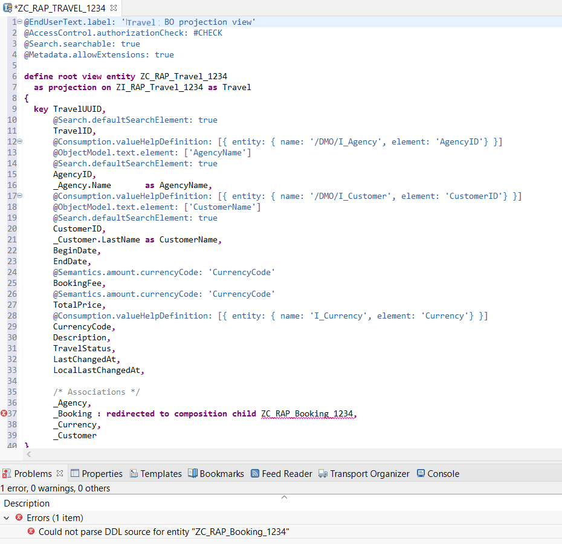
    
    **Short explanation: What has changed?**
    - The alias **`Travel`** is specified for the projected view
    - The keyword **`root`** is specified in the **`DEFINE`** statement to specify the projected Travel BO as root node.
    - The view annotations **`@Metadata.allowedExtension`** is specified before the **`DEFINE`** statement to allow the projection view to be enhanced with separate metadata extensions 
    - The view annotations **`@Search.Searchable`** is specified before the **`DEFINE`** statement to allow the projection view to enable the full-text (aka freestyle) search.
    - The freestyle search is enabled for the view elements **`TravelID`**, **`AgencyID`** and **`CustomerID`** using the annotation **`@Search.DefaultSearchElement`**.
    - The view elements **`AgencyName`** from the association **`_Agency`** and **`CustomerName`** from the association **`_Customer`** have been added to the projection list.
    They are specified as  textual description for the view elements **`AgencyID`** and **`CustomerID`** respectively using the **`@ObjectModel.text.element`** annotation.
    - Value helps are specified for the view elements **`AgencyID`**, **`CustomerID`**, and **`CurrencyCode`** using the annotation **`@Consumption.valueHelpDefinition`**. 
    The name of the target CDS entity that acts as a value help provider and the name of its element that is linked to the local element have to be specified. 
    - The view element **`CurrencyCode`** is specified as the reference field for the currency fields **`BookingFee`** and **`TotalPrice`** using the **`@Semantics.amount.currencyCode`**  annotations. 
    - The view elements **`CreatedBy`**, **`CreatedAt`** and **`LastChangedBy`** have been removed from the projection list because they only have an are administrative function and will be of no use in our scenario. The view elements **`LastChangedAt`** and **`LocalLastChangedAt`** remain in the projection list because they will be used for the transactional enablement of Your Travel List Report App in week 3 – especially for the implementation of the optimistic lock.
    - associations have been exposed in the projection list
    - association to the booking BO child node (**`_Booking`**) has been redirected to the appropriate Booking BO projection view using the **`redirected to composition child`**  statement.    
         
    An error is currently displayed for this statement, because the specified Booking BO projection view **`ZC_RAP_Booking_####`** does not yet exist. 
    
## Step 2. Create the Booking Projection View
Now, you will create the missing Booking BO projection view (aka consumption view) **`ZC_RAP_BOOKING_####`** for the Booking entity - where **`####`** is your chosen suffix.

1. Right-click on your Booking BO view (aka interface view) **`ZI_RAP_BOOKING_####`** and choose **New Data Definition** from the context menu.
 
    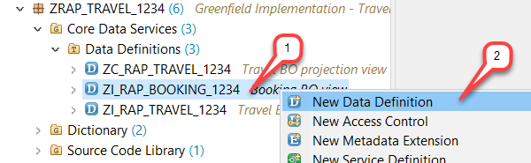

2.  Maintain **`ZC_RAP_BOOKING_####`** as name and a meaningful description (e.g. _**Booking BO projection view**_) in the creation wizard and choose **Next >** to continue.  
    The project, the package and the referenced object have been automatically assigned in the creation wizard.  
 
    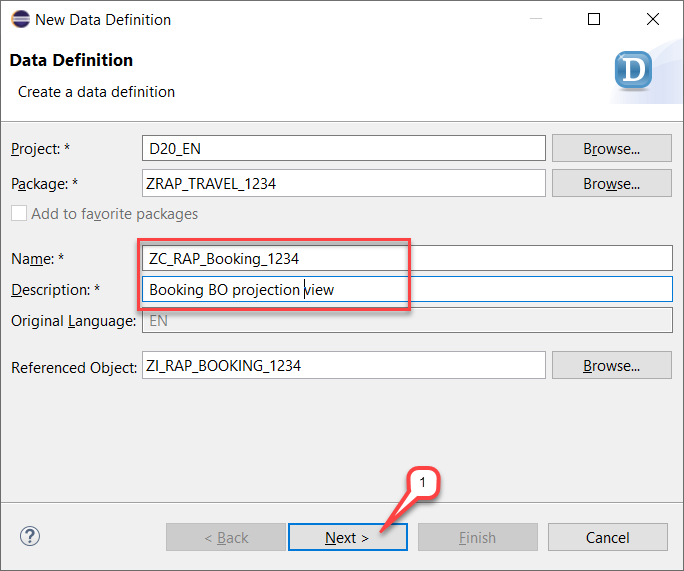

3. Assign a transport request and choose **Next >**. 
 
    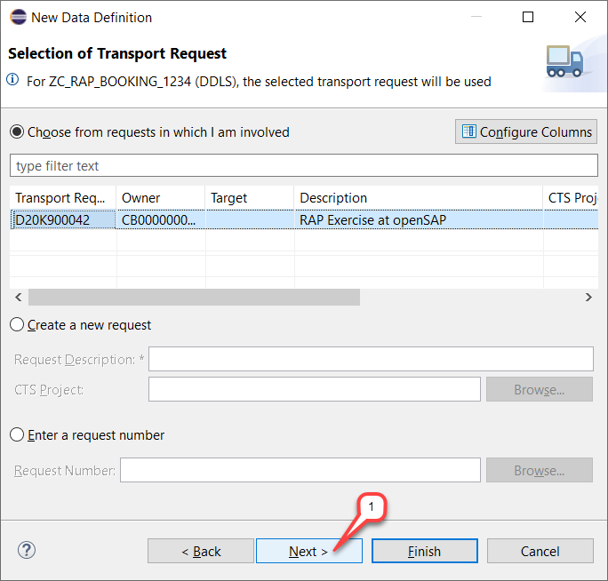

4. Choose the **`Define Projection View`** template from the list and then choose **Finish**.

    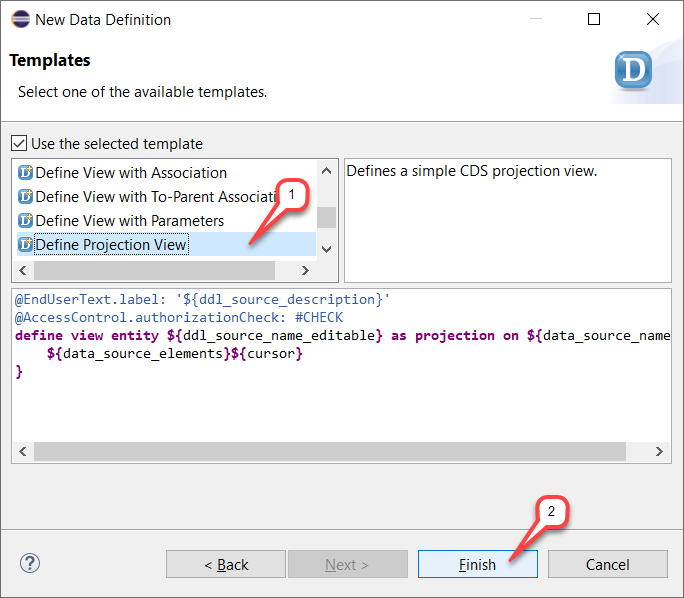

    The new data definition appears in the editor.
 
    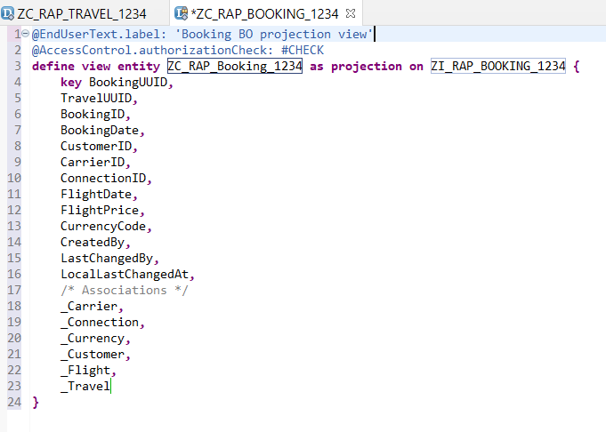

    **Short Explanation:**
    The booking BO view is specified as projection view and all view elements have been automatically inserted in the projection list between the curly brackets.

5. Replace the booking data definition in the editor with the code snippet provided below and replace all occurrences of **`####`** with your chosen suffix. You can make use of the _Replace All_ feature (**Ctrl+F**) in ADT for the purpose.

    Save  the changes, but **DO NOT** yet activate the booking BO projection view.

    You can make use of the Source Code Formatter (**Shift+1**) to format the source code.
    
    ```ABAP
    @EndUserText.label: 'Booking BO projection view'
    @AccessControl.authorizationCheck: #CHECK
    @Search.searchable: true
    @Metadata.allowExtensions: true

    define view entity ZC_RAP_Booking_####
      as projection on ZI_RAP_Booking_#### as Booking
    {
      key BookingUUID,
          TravelUUID,
          @Search.defaultSearchElement: true
          BookingID,
          BookingDate,
          @Consumption.valueHelpDefinition: [{ entity : {name: '/DMO/I_Customer', element: 'CustomerID'  } }]
          @ObjectModel.text.element: ['CustomerName']
          @Search.defaultSearchElement: true
          CustomerID,
          _Customer.LastName as CustomerName,
          @Consumption.valueHelpDefinition: [{entity: {name: '/DMO/I_Carrier', element: 'AirlineID' }}]
          @ObjectModel.text.element: ['CarrierName']
          CarrierID,
          _Carrier.Name      as CarrierName,
          @Consumption.valueHelpDefinition: [ {entity: {name: '/DMO/I_Flight', element: 'ConnectionID'},
                                               additionalBinding: [ { localElement: 'CarrierID',    element: 'AirlineID' },
                                                                    { localElement: 'FlightDate',   element: 'FlightDate',   usage: #RESULT},
                                                                    { localElement: 'FlightPrice',  element: 'Price',        usage: #RESULT },
                                                                    { localElement: 'CurrencyCode', element: 'CurrencyCode', usage: #RESULT } ] } ]
          ConnectionID,
          FlightDate,
          @Semantics.amount.currencyCode: 'CurrencyCode'
          FlightPrice,
          @Consumption.valueHelpDefinition: [{entity: {name: 'I_Currency', element: 'Currency' }}]
          CurrencyCode,
          LocalLastChangedAt,

          /* associations */
          _Travel : redirected to parent ZC_RAP_Travel_####,
          _Customer,
          _Carrier,
          _Connection,
          _Flight
    }
    ```

    The data definition now looks as follows. 
    
     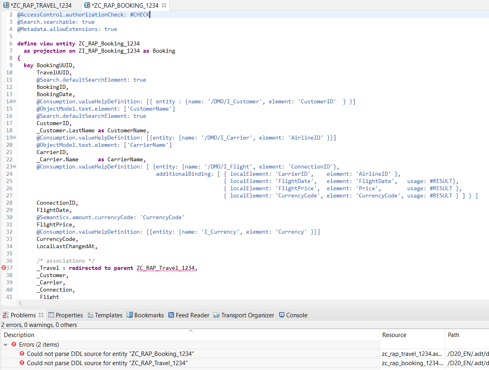

    **Short explanation: What has changed?**  
    -	The alias Booking is specified for the projected view
    -	The view annotations **`@Metadata.allowedExtension`** is specified before the **`DEFINE`** statement to allow the projection view to be enhanced with separate metadata extensions 
    -	The view annotations **`@Search.Searchable`** is specified before the **`DEFINE`** statement to allow the projection view to enable the full-text (aka freestyle) search.
    -	The view columns **`BookingID`** and **`CustomerID`** are enabled for freestyle search.  
    The view elements **`CustomerName`** and **`CarrierName`** from the associations **`_Customer_`** and **`_Carrier`** respectively have been added to the projection list.  
    They are specified as  textual description for the view elements **`CustomerID`** and **`CarrierID`** respectively using the annotation **`@ObjectModel.text.element`**.  
    -	Value helps are specified for the view elements **`CustomerID`**, **`CarrierID`**, **`ConnectionID`** and **`CurrencyCode`** using the annotation **`@Consumption.valueHelpDefinition`**.  
    In the value help definition of the element **`ConnectionID`**, an additional binding condition is defined for returning values from the selected value help record for the local view elements **`CarrierID`**, **`FlightDate`**, **`FlightPrice`** and **`Currency`**.
    -	The view element **`CurrencyCode`** is specified as reference field for the currency field **`FlightPrice`**. 
    -	The view elements **`CreatedBy`** and **`LastChangedBy`** have been removed from the projection list because they only have an administrative function and will be of no use in our scenario. The view element **`LocalLastChangedAt`** remains in the projection list because it will be used for the transactional enablement of Your Travel List Report App in week 3 – especially for the implementation of the optimistic lock.  
    -	All associations have been exposed in the projection list.
    -	The association to the travel BO parent node has been redirected to the appropriate Travel BO projection view using the  **`redirected to parent`**  statement. 

## Step 3. Activate the CDS Data Model Projection & Run the Data Preview 
To avoid error during the activation, both new CDS interface views – i.e. Travel view and Booking view – must be activated together for the first time.  

1.	Choose **`Activate All`**  or use the shortcut **Ctrl+Shift+F3**.    
    Select both CDS views **`ZC_RAP_TRAVEL_####`** and **`ZC_RAP_BOOKING_####`** on the appearing dialog, and choose **Activate**.
 
    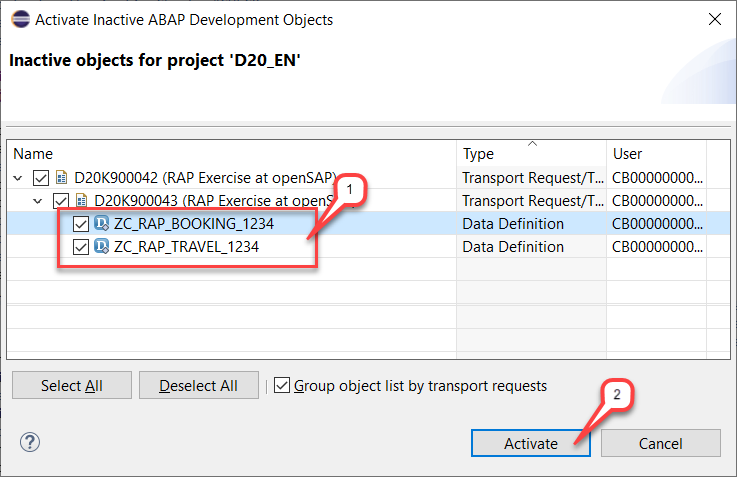

    Your projected CDS data model consisting of the Travel BO projection view and the Booking BO projection view are now activated, but warnings are displayed in the _Problems_ view. The reason behind this is that the authority check is allowed for these CDS views (using the view annotation **`@AccessControl.authorizationCheck: #CHECK`**), but no CDS access control is yet defined for them.    
             
    You will work on this in unit 7 of week 2 where you will implement a basic CDS access control.
         
 
    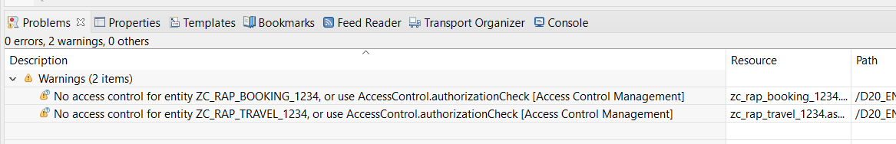

2.	To run the Data Preview, choose one of the CDS views - i.e. **`ZC_RAP_TRAVEL_####`** or **`ZC_RAP_BOOKING_####`** - in the Project Explorer or open it in the editor, and press **F8**.   
       
    The data preview will open in the editor area.    
 
    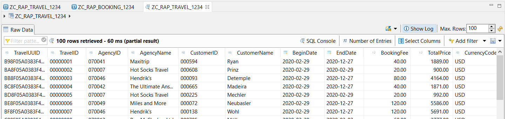
 
    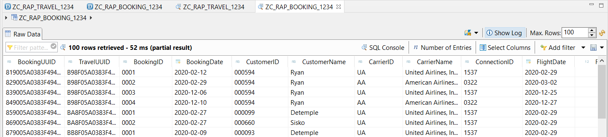


# Enriching the Projected Data Model with UI Metadata
> [Exercise](#abap-restful-programming-model-exercise) > [Content](#content) > [This section](#enriching-the-projected-data-model-with-ui-metadata)
## Introduction
You will enrich your CDS data model projection with UI metadata for the latter generation of an SAP Fiori elements-based Travel list report app. The focus of this course is on the RESTful back-end implementation of apps. Therefore, we will use only a few UI annotations to enrich the projected CDS data model for the later generation of our SAP Fiori elements Travel app.  
    
You have previously specified the view annotation **`@Metadata.allowExtensions:true`** in the BO projection views to allow their modification-free enhancement using separate CDS metadata extensions.  
    
You can watch [week 2 unit 5: Enriching the Projected Data Model with UI Metadata](https://open.sap.com/courses/cp13/items/4Xob2TI2k2XfSgWRrsh85P) on the openSAP platform.

## Step 1. Annotate the Travel Projection View
First, create the CDS metadata extensions **`ZC_RAP_Travel_####`** (where `####` is your chosen suffix) to enrich the Travel BO projection view with UI semantics.

1.	Right-click on your Travel BO projection view **`ZC_RAP_Travel_####`** in the Project Explorer and select **New Metadata Extension** from the context menu.
 

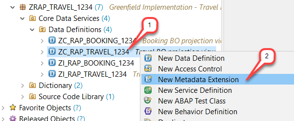


2.	Maintain **`ZC_RAP_Travel_####`** as name and a meaningful description (e.g. _**UI Annotations for `ZC_RAP_Travel_####`**_) and choose _**Next >**_ to continue.    
Project, Package and Extended Entity are automatically assigned in the creation wizard.  
 
    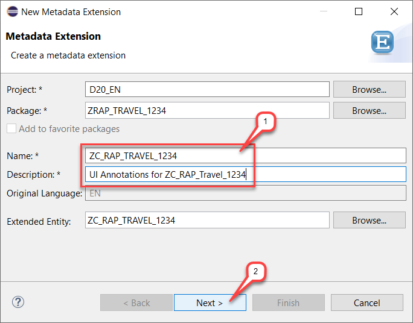


3.	Assign a transport request and choose **Next >**.  
 
    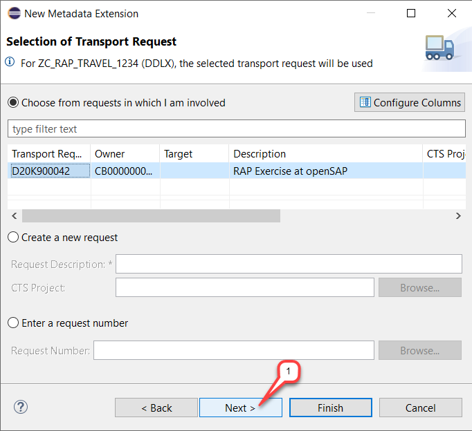

4.	Metadata extension templates are provided for your convenience.   
    Choose the **annotate view** template and choose **Finish**.
 
    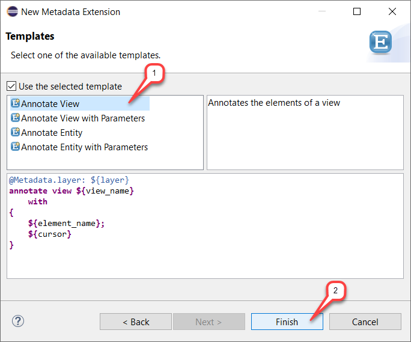
    
    The new metadata extension appears in the editor.   
 
    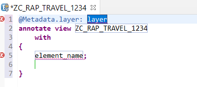

    **Short Explanation:**    
The **`@Metadata.layer`** annotation is specified at the top. The name of the BO projection view is specified after the **`ANNOTATE VIEW`** statement and a dummy entry is defined between the curly brackets.   


5.	Specify the metadata layer at the top of the extension as follows   
**` @Metadata.layer: #CORE`** .  
    Remove the dummy entry **`element_name;`** and insert all view elements between the curly brackets. You can make use of the code Completion (**Ctrl+Space**) for that.  
 
    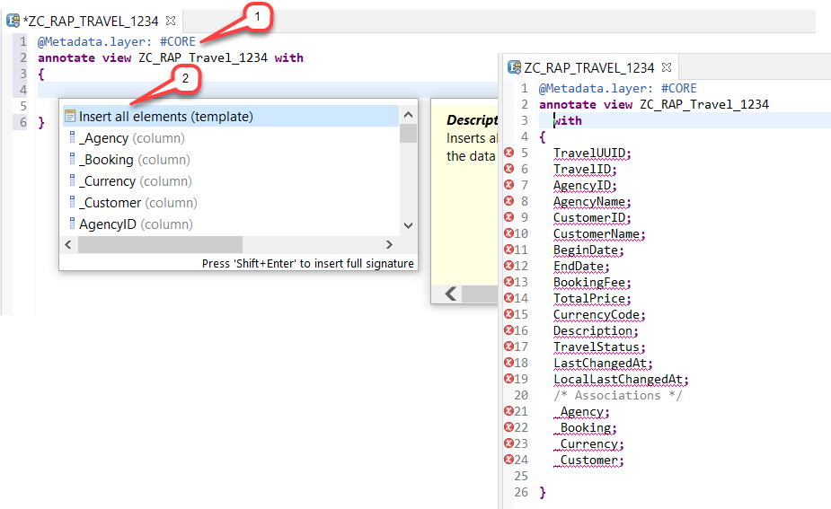

6.	Some of the consumption specific element annotations specified in the BO projection views make the need for UI annotations redundant. This is the case for the elements **`AgencyName`** and **`CustomerName`** which are the textual descriptions for **`AgencyID`** and **`CustomerID`** respectively, and for the element **`CurrencyCode`** which is the reference field for **`BookingFee`** and **`TotalPrice`**.   
    These three elements will be automatically displayed together with their related elements on the UI.   

    Therefore, remove the elements **`AgencyName`**, **`CustomerName`**, and **`CurrencyCode`**, and also all associations, i.e.  **`_Currency`**, **`_Booking`** and **`_Agency`** and **`_Customer`**, from the element list.     
          
 
    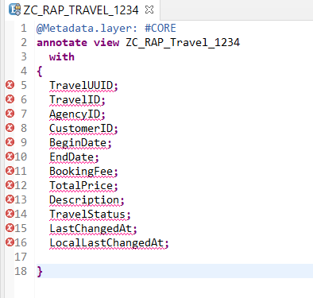

7.	Now, you can specify the UI annotations for the remaining elements.   
    For that, replace the code in the editor with the code snippet provided below and replace all occurrences of  `####` with your chosen suffix.   
        
    You can make use of the _Replace All_ feature (**Ctrl+F**) in ADT for the purpose and also of the _Source Code Formatter_ (**SHIFT+F1**) to format the source code.  

    ```ABAP
    @Metadata.layer: #CORE
    @UI: {
      headerInfo: { typeName: 'Travel',
                    typeNamePlural: 'Travels',
                    title: { type: #STANDARD, label: 'Travel', value: 'TravelID' } },
      presentationVariant: [{ sortOrder: [{ by: 'TravelID', direction:  #DESC }] }] }

    annotate view ZC_RAP_Travel_#### with
    {
      @UI.facet: [ { id:              'Travel',
                     purpose:         #STANDARD,
                     type:            #IDENTIFICATION_REFERENCE,
                     label:           'Travel',
                     position:        10 },
                   { id:              'Booking',
                     purpose:         #STANDARD,
                     type:            #LINEITEM_REFERENCE,
                     label:           'Booking',
                     position:        20,
                     targetElement:   '_Booking'} ]  

      @UI:{ identification: [{ position: 1, label: 'Travel UUID' }] }
      TravelUUID;

      @UI: {  lineItem:       [ { position: 10 } ],
              identification: [ { position: 10 } ],
              selectionField: [ { position: 10 } ] }  
      TravelID;

      @UI: {  lineItem:       [ { position: 20 } ],
              identification: [ { position: 20 } ],
              selectionField: [ { position: 20 } ] }  
      AgencyID;

      @UI: {  lineItem:       [ { position: 30 } ],
              identification: [ { position: 30 } ],
              selectionField: [ { position: 30 } ] }  
      CustomerID;

      @UI: {  lineItem:       [ { position: 40 } ],
              identification: [ { position: 40 } ] }  
      BeginDate;

      @UI: {  lineItem:       [ { position: 50 } ],
              identification: [ { position: 50 } ] }   
      EndDate;

      @UI: {  lineItem:       [ { position: 60 } ],
              identification: [ { position: 60 } ] }   
      BookingFee;

      @UI: {  lineItem:       [ { position: 70 } ],
              identification: [ { position: 70 } ] }   
      TotalPrice;

      @UI: {  lineItem:       [ { position: 80 } ],
              identification: [ { position: 80 } ] }   
      Description;

      @UI: {  lineItem:       [ { position: 90 } ],
              identification: [ { position: 90 } ] }   
      TravelStatus;

      @UI.hidden: true
      LastChangedAt;

      @UI.hidden: true
      LocalLastChangedAt;
    }
    ```
 
     
     The results looks as follows:    
     
    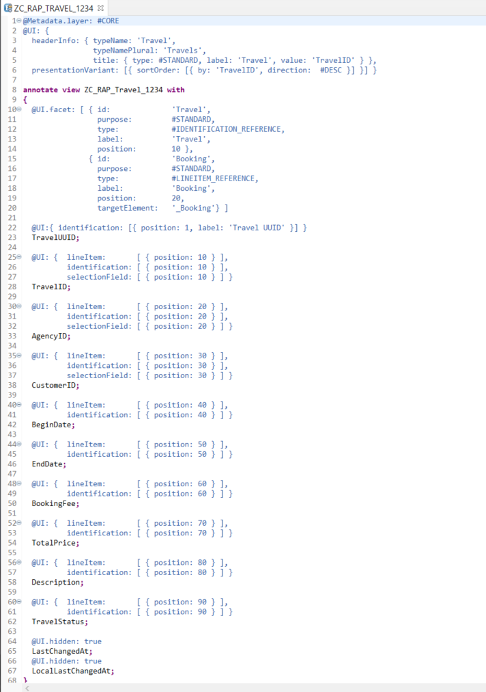

    **Short Explanation:  What has changed?**   
    -	**`#CORE`** is specified as the metadata layer since you are the application provider.   
    When multiple metadata extensions are defined for a given CDS entity, the layer determines the priority of the metadata. **`#CORE`** has the lowest, and **`#CUSTOMER`** the highest priority.
    -	Header information – such as type name and Title – and the presentation variant for our list report app using **`@UI`** view annotations are defined at the top before the **`ANNOTATE VIEW`** statement. The queried travel data will be sorted in the descending order by the element **`TravelID`** in the list.
    -	The navigation to the object page and its layout is defined using **`@UI.facet`** annotations in the curly brackets. The travel object page has two facets: the identification reference of the travel entity and the line item reference of the Booking entity – with the **`_Booking`** composition specified as target element.
    -	Various **`@UI`** annotations are used to specify the layout of each elements on the travel list and the object page.
        
    
 >   
 >**About the UI Annotations**    
 > As already mentioned, the focus of this course is on the RESTful back-end implementation of apps. Therefore, we will use only a few UI annotations to enrich the projected CDS data model for the later generation of our SAP Fiori elements Travel app.  
 > More information about [Defining CDS Annotations for Metadata-Driven UIs](https://help.sap.com/viewer/923180ddb98240829d935862025004d6/Cloud/en-US/9b4aa865c1e84634b6e105173fc3a5e7.html) and the [UI Annotations supported in ABAP CDS](https://help.sap.com/viewer/923180ddb98240829d935862025004d6/Cloud/en-US/5587d47763184cc48f164648b53c1e4f.html) can be found in the  SAP Help Portal.     
 >    
 >For example,     
 >- The UI annotation **`@UI.lineItem`**  is used to specify the layout information of each elements shown as column in the list.  
 >- The UI annotation **`@UI.identification`** is used to specify the layout information of each element shown in the identification section of the object page.  
 >- The UI annotation **`@UI.selectionField`** is used to enable an element for selection in the filter bar. If a value-help is defined for the given element, then it is automatically exposed to the UI.  
 > - For the positioning order, any decimal number can be used as value for the property **`position`**.  
 > - With the UI annotation **`@UI.hidden:true`**, we prevent elements from being displayed on the UI or in the personalization settings dialog.    
        

8.	Save  and activate  the changes.  


## Step 2. Annotate the Booking Projection View
Now, you will create the CDS metadata extensions **`ZC_RAP_Booking_####`** (where `####` is your chosen suffix)  to enrich the Booking BO projection view with UI semantics.  

1.	Right-click on your Booking BO projection view **`ZC_RAP_Booking_####`** in the Project Explorer and choose **New Metadata Extension** from the context menu.  
 
    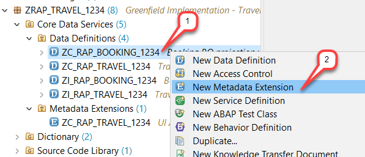

2.	Maintain **`ZC_RAP_Booking_####`** as name and a meaningful description (e.g. _UI Annotations for ZC_RAP_Booking_####_)  and choose **Next >** to continue.  
    Project, Package and Extended Entity are automatically assigned in the creation wizard.  
 
    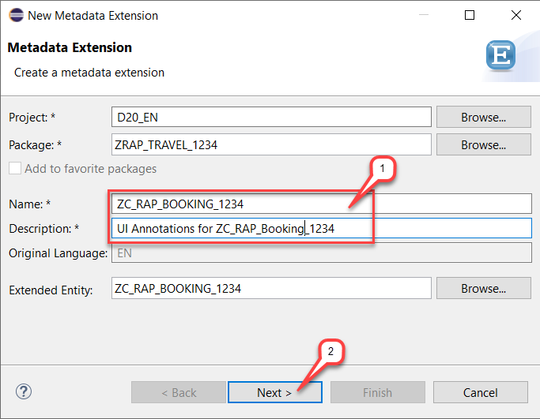
    
3.	Assign a transport request and choose **Next >**. 
 
    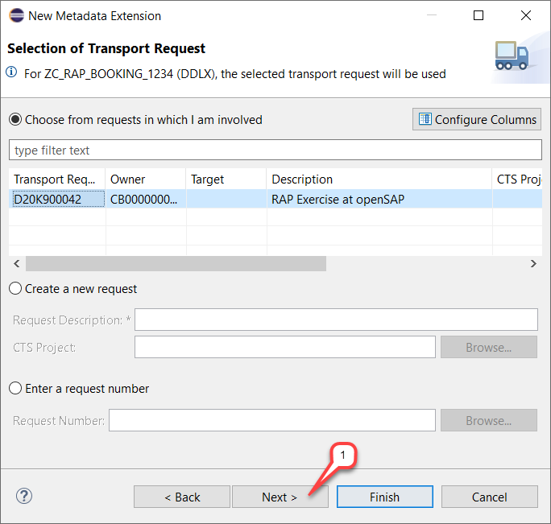

4.	Select the annotate view template and choose **Finish**.
 
    

    The new metadata extension appears in the editor. 
 
    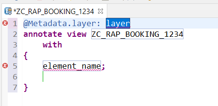

5.	Specify **`#CORE`** as metadata layer at the top of the extension.    
Remove the dummy entry **`element_name;`** and insert all view elements between the curly brackets. You can make use of the code Completion (**Ctrl+Space**) for that.    

 
    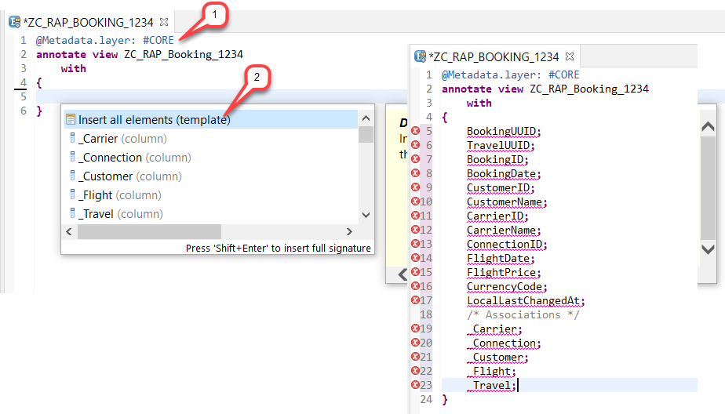

6.	In the Booking BO projection view, the elements **`CustomerName`** and **`CarrierName`** are specified as the textual description for the elements **`CustomerID`** and **`CarrierID`** respectively, and the element **`CurrencyCode`** is specified as the reference field for the element **`FlightPrice`**. These elements will be automatically displayed on the UI without required explicit UI annotations.  

    Therefore, remove the elements **`CustomerName`**, **`CarrierName`**, and **`CurrencyCode`**, and also all associations, i.e.  **`_Carrier`**,  **`_Connection`**,  **`_Customer`**,  **`_Flight`** and **`_Travel`** from the element list.  

 
    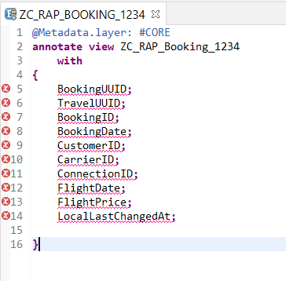

7.	Now, you can specify the UI annotations for the remaining elements.  
    For that, replace the code in the editor with the code snippet provided below and replace all occurrences of  `####` with your chosen suffix. 
    
    You can make use of the _Replace All_ feature (**Ctrl+F**) in ADT for the purpose and also of the _Source Code Formatter_ (**SHIFT+F1**) to format the source code.  

    ```ABAP
    @Metadata.layer: #CORE
    @UI: {
      headerInfo: { typeName: 'Booking',
                    typeNamePlural: 'Bookings',
                    title: { type: #STANDARD, value: 'BookingID' } } }

    annotate view ZC_RAP_Booking_####
        with 
    {
      @UI.facet: [ { id:            'Booking',
                     purpose:       #STANDARD,
                     type:          #IDENTIFICATION_REFERENCE,
                     label:         'Booking',
                     position:      10 }  ]

      @UI: { identification: [ { position: 10, label: 'Booking UUID'  } ] }
      BookingUUID;

      @UI.hidden: true
      TravelUUID;

      @UI: { lineItem:       [ { position: 20 } ],
             identification: [ { position: 20 } ] }
      BookingID;

      @UI: { lineItem:       [ { position: 30 } ],
             identification: [ { position: 30 } ] }
      BookingDate;

      @UI: { lineItem:       [ { position: 40 } ],
             identification: [ { position: 40 } ] }
      CustomerID;

      @UI: { lineItem:       [ { position: 50 } ],
             identification: [ { position: 50 } ] }
      CarrierID;

      @UI: { lineItem:       [ { position: 60 } ],
             identification: [ { position: 60 } ] }
      ConnectionID;

      @UI: { lineItem:       [ { position: 70 } ],
             identification: [ { position: 70 } ] }
      FlightDate;

      @UI: { lineItem:       [ { position: 80 } ],
             identification: [ { position: 80 } ] }
      FlightPrice;

      @UI.hidden: true
      LocalLastChangedAt;
    }
    ```
 
    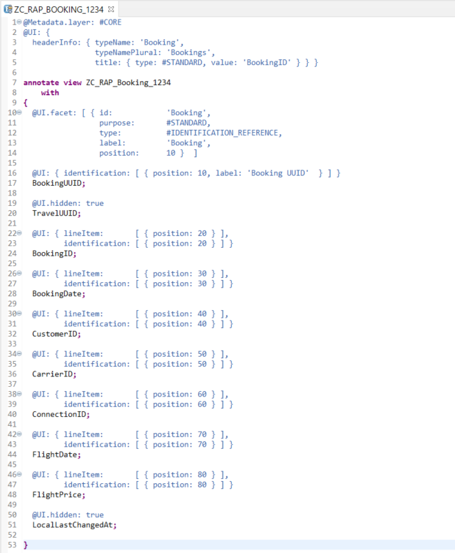

**Short Explanation: What has changed?**  
-	**`#CORE`** is specified as the metadata layer since you are the application provider.  
-	The header information (type name and Title) for the booking list is defined at the top before the **`ANNOTATE VIEW`** statement.
-	The navigation to the booking object page and its layout is defined using **`@UI.facet`** annotations in the curly brackets.
-	Various **`@UI`** annotations are used to specify the layout of each elements on the travel list and the object page.

8.	Save  and activate  the changes.  


# Developing and Previewing the Business Service
> [Exercise](#abap-restful-programming-model-exercise) > [Content](#content) > [This section](#developing-and-previewing-the-business-service)
## Introduction
In the present  exercise, you will expose your projected CDS data model as OData service using business services – i.e. service definition and service binding.  
    
You can watch [week 6 unit 6: Creating and Previewing the OData UI Service](https://open.sap.com/courses/cp13/items/1Q2sDNNIMgTA0IEDL6RUT3) on the openSAP platform.

## Step 1. Create the Service Definition
First, create the service definition **`ZUI_RAP_Travel_####`** (where `####` is your chosen suffix) to specify the service scope, i.e. the relevant entity sets to be exposed in the service.

1.	In the Project Explorer, right-click on the Travel BO projection view **`ZC_RAP_TRAVEL_####`** and select **New Service Definition** from the context menu.

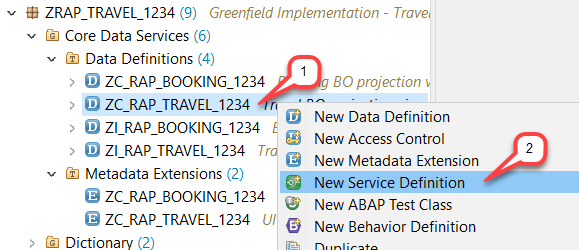


2.	Maintain **`ZUI_RAP_Travel_####`** as name and a meaningful description (e.g. _**`Serv Definition for Travel App`**_) in the creation wizard and choose **Next >** to continue.     
    Package and Project have been assigned automatically.  

 
    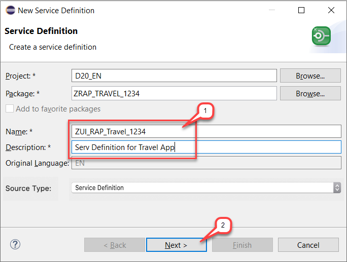


3.	Assign a transport request and choose **Next >**. 
 
    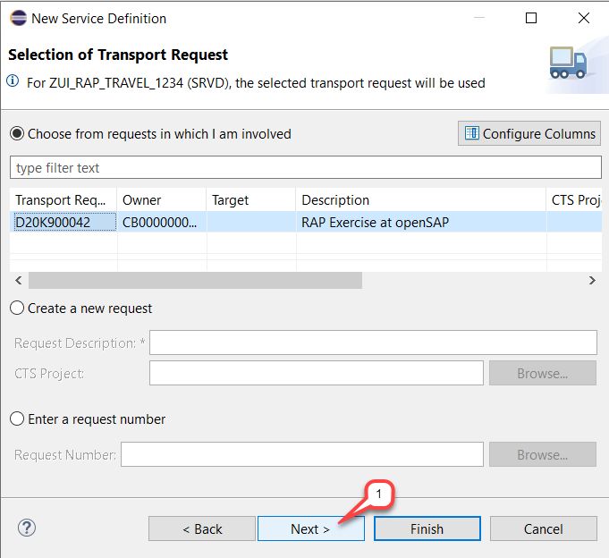

4.	Select the template **`Define Service`**  and choose **Finish**. 

    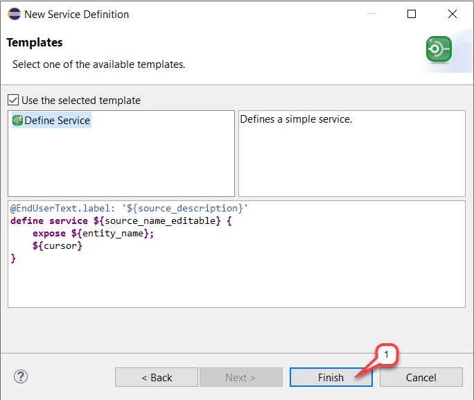

    The new service definition now appears in the editor.   
    A dummy entity is exposed between the curly brackets using the keyword **`expose`**.
 
    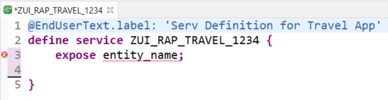

5.	Now, define the service scope by specifying the CDS view names of the relevant BO entities and associations – e.g. Travel and Booking entities and value help providers for the Agency, Customer, Flight, Carrier entities and the Currency code – and specify a local alias for each of them using the keyword **`as`**. Aliases are optional but ease the service consumption.   
  
    For that, replace the code in the editor with the code snippet provided below. 
    Do not forget to replace all the occurrences of `####` with your chosen suffix. You can make use of the Replace All feature (**Ctrl+F**) in ADT for the purpose.

    ```ABAP
    @EndUserText.label: 'Serv Definition for Travel App'
    define service ZUI_RAP_TRAVEL_#### {
      expose ZC_RAP_Travel_#### as Travel;
      expose ZC_RAP_Booking_#### as Booking;
      expose /DMO/I_Agency as Agency;
      expose /DMO/I_Customer as Customer;
      expose /DMO/I_Flight as Flight;
      expose /DMO/I_Carrier as Carrier;
      expose /DMO/I_Connection as Connection;
      expose /DMO/I_Airport as Airport;
      expose I_Currency as Currency;
      expose I_Country as country;
    }
    ```
    
    The service definition will now look as follows:  

    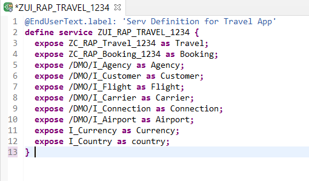

6.	Save  and activate  the service definition.

    
## Step 2. Create the Service Binding
Now, create the service binding **`ZUI_RAP_TRAVEL_O2_####`** (where `####` is your chosen suffix)  to bind your service definition to the OData protocol.  

1.	Right-click on the just created service definition **`ZUI_RAP_TRAVEL_####`** in the project Explorer and choose **New Service Binding** from the context menu.   
        
    The project, the package and the service definition are automatically assigned in the creation wizard.

    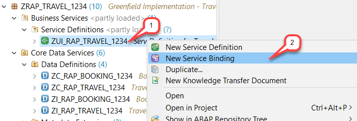

2.	Maintain **`ZUI_RAP_TRAVEL_O2_####`**  as name and a meaningful description (e.g. _`OData V2 UI service for SAP Fiori Travel App`_).     Select **`OData V2 - UI`** as Binding Type and choose **Next >** to continue.  
     
    >Note: At the creation time of this document, only OData V2 was supported. However, OData V4 is planned in the near future.
    >For more information, check out the [ABAP platform road map](https://roadmaps.sap.com/board?range=CURRENT-LAST&PRODUCT=6EAE8B28C5D91EDA9FF40F3CC2DBE0E6&PRODUCT=73555000100800001164).  
    
    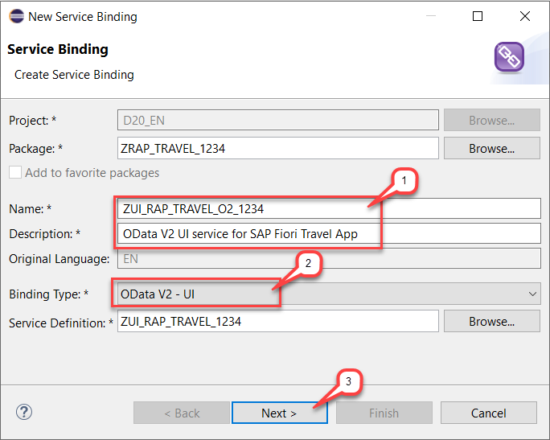
    
3.	Assign a transport request and choose **Finish**.  
     
    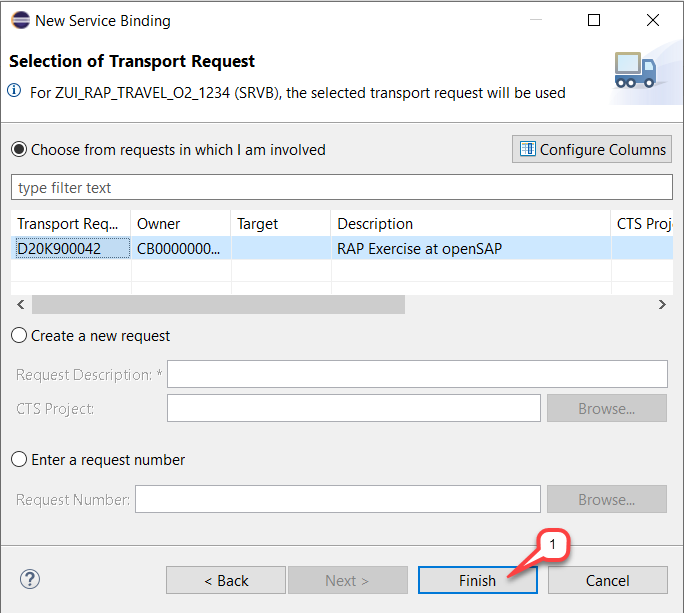

    The new service binding now appears in the appropriate editor.  
     
    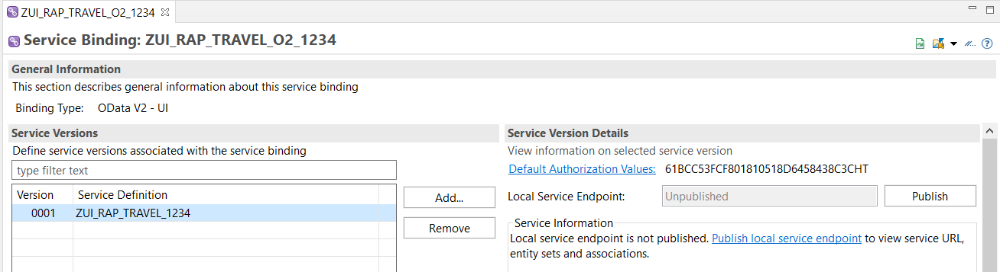

4. Save  and activate  the service binding.	

5. Click on **`Publish`** - or **`Activate`** depending on your ADT version - in the **Service Version Details** area to activate the Local Service Endpoint. This may take few seconds.
 
    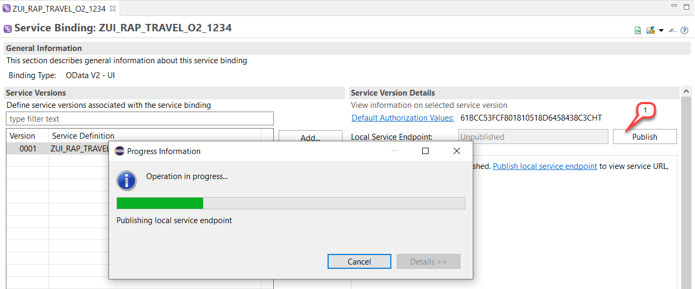

    
    The local service endpoint is now activated and ready for consumption through an OData client. The relative service URL and the exposed entity sets, and associations are now shown in the **Service Version Details** area on the right-hand side of the _Service Binding_ editor.   
        
    In the Project Explorer, you can see the artefacts that have been generated during the activation. Refresh (F5) your package if needed.  
    
    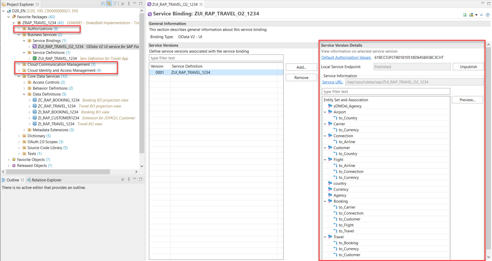
    
6.	Click on the Service URL link to have a quick look at the service metadata document in the browser.  
    Maintain your ABAP user credentials if required and choose **Log On**.  
    
    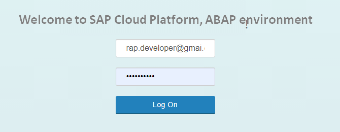


    The service document will open in the browser.  
         
    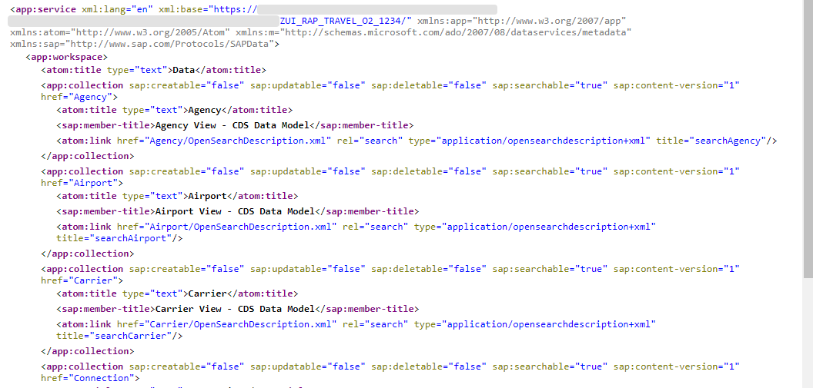
    
## Step 3. Preview the Travel App and Play Around

1. Go back to your service binding in the _Service Binding_ editor, choose the **`Travel`** node in _**Entity Set and Association**_ area and either right-click on it and choose _**Open Fiori elements App preview**_ from the context menu or simply double-click on it – or choose the **Preview** button.  
     
    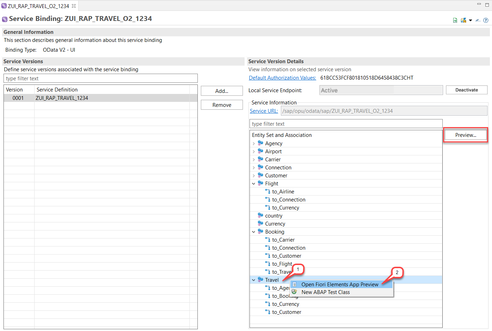

    Your SAP Fiori elements-based Travel List Report app will open in the browser. Provide your ABAP user credentials if required.  
    Press the **Go** button on the app to load the back-end data.   
       
     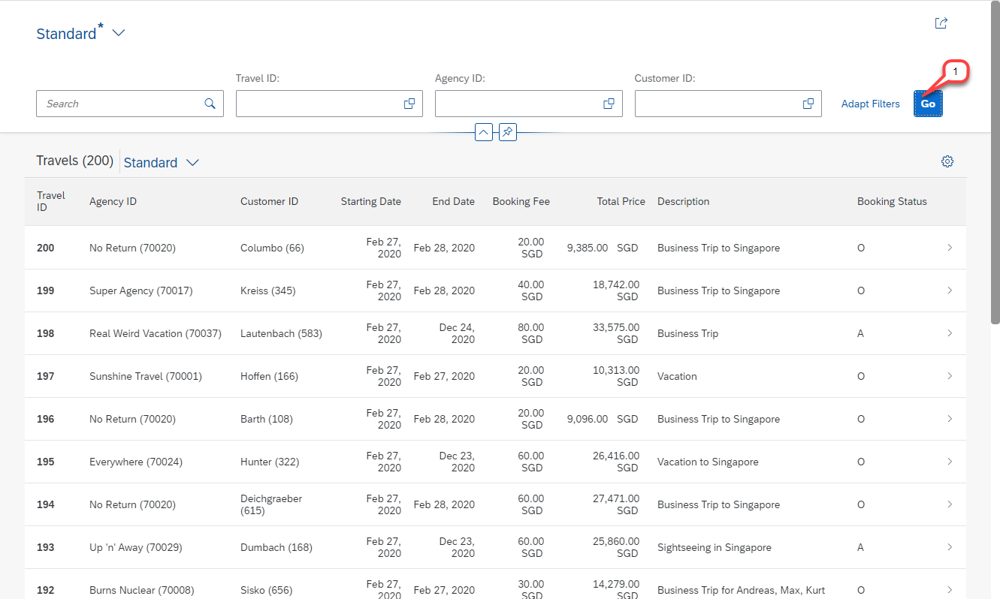

2. You can now explore your Travel App.  
    For example,  
    - Perform a full text search (e.g. for **`Pan`**)
    - Filter bar: Filter the entries by an **`AgencyID`** using the defined value help.  
      Do not forget to clear the filter at the end. 
    - Navigate to the details object page of a travel record in the travel table list.
    - Check out the travel details object page with its two facets _Travel_ and _Booking_, and navigate to the booking details object page and explore it.


